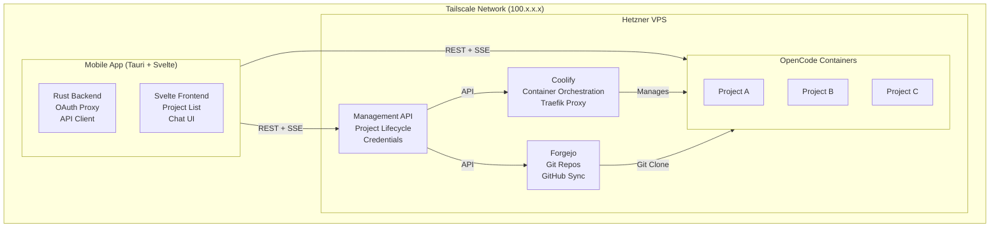
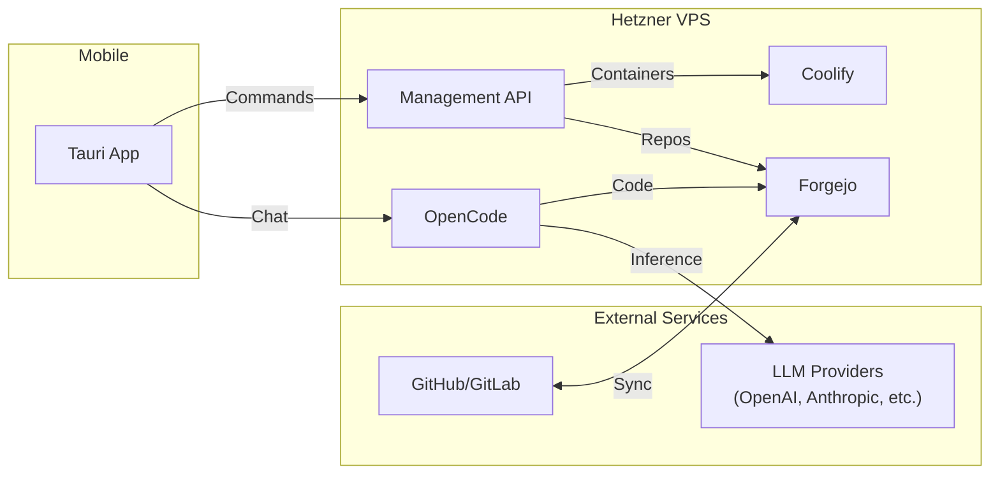

# Project: Portable Command Center

A bespoke mobile application that acts as a "remote control" for an AI coding agent (OpenCode) running on a remote server. The heavy processing stays on the server; the phone provides a fast, native-feeling interface.

---

## Table of Contents

- [Vision](#vision)
- [Infrastructure Overview](#infrastructure-overview)
- [Architecture](#architecture)
- [Core Components](#core-components)
- [Technology Stack](#technology-stack)
- [Implementation Phases](#implementation-phases)
- [Resources](#resources)

---

## Vision

### The Concept

You are building a **"Virtual Office"** — a one-person company powered by AI agents. The core idea:

- **The Brain is Remote**: Heavy "thinking," coding, and data processing run on your Hetzner VPS. This ensures your AI has maximum resources without draining your phone's battery.
- **The Interface is Local**: Your mobile phone runs a lightweight, high-performance app that connects to your server via Tailscale. This app handles the visuals and user input.
- **The "Native" Experience**: Even though the content is web-based, the app is designed to feel indistinguishable from a high-end, native mobile application — smooth animations, clean layout, and intuitive touch controls.
- **Full Version Control**: All project files live in Forgejo (self-hosted Git), providing complete version history, collaboration capabilities, and the ability to sync with GitHub/GitLab.

### Why OpenCode?

[OpenCode](https://opencode.ai) (by SST) is the intelligence layer:

1. **Client/Server Architecture** — Designed to run the "Brain" on a server and stream to a client. Perfect for mobile.
2. **Vendor Neutrality** — 100% open source. Plug in any AI model (Claude, GPT, GitHub Copilot, local via Ollama).
3. **Agentic by Default** — Not just autocomplete; it plans and executes multi-step tasks autonomously.
4. **75+ LLM Providers** — Support for virtually any LLM provider with flexible authentication.

---

## Infrastructure Overview

### Your Resources

| Device | Role | Connection | Workload |
|--------|------|------------|----------|
| **Hetzner VPS** | Primary server | Tailscale + Public IP | Coolify, Forgejo, Management API, OpenCode containers |
| **Mobile** | Client | Tailscale | Portable Command Center app |

### Network Topology

All devices connected via **Tailscale** mesh VPN:
- Zero-trust security (no public port exposure needed)
- Encrypted connections between all devices
- Works behind NAT, firewalls, anywhere
- Each device gets a stable 100.x.x.x IP

---

## Architecture

### Component Relationships

---

## Core Components

### 1. Coolify (Container Orchestration)

Self-hosted PaaS that manages Docker containers on the VPS.

**Key Capabilities:**
- Deploy Docker images
- Environment variable management (stores LLM credentials)
- Automatic SSL via Traefik
- REST API for programmatic control

**API Endpoints Used:**
| Operation | Endpoint | Purpose |
|-----------|----------|---------|
| Create App | `POST /applications/dockerimage` | Spin up new OpenCode container |
| Set Env Vars | `POST /applications/:uuid/envs` | Configure LLM API keys |
| Start/Stop | `GET /applications/:uuid/start\|stop` | Control containers |

### 2. Forgejo (Git Forge)

Self-hosted Git forge for all project files.

**Key Capabilities:**
- Full Git version control
- Web UI for browsing code
- API for repo management
- GitHub/GitLab mirroring

**Workflows:**
- **New project from scratch**: Create empty Forgejo repo
- **Import from GitHub/GitLab**: Clone external repo into Forgejo
- **Sync back to GitHub**: Push changes after OpenCode updates

### 3. Management API (Custom Service)

Backend service that orchestrates operations.

**Responsibilities:**
- Wrap Coolify API for mobile-friendly operations
- Handle project lifecycle (create, clone, sync)
- Manage background operations
- Coordinate with Forgejo for repo management
- Store and inject LLM credentials into containers

**Why Separate Service?**
- Runs independently of mobile app
- Can trigger operations from CI/CD, web, etc.
- Handles long-running background tasks
- Centralizes business logic

### 4. OpenCode Containers

Individual Docker containers running OpenCode server mode.

**Per-Container Setup:**
- Cloned project from Forgejo
- OpenCode server on unique port
- LLM credentials via environment variables
- Persistent workspace volume

**Configuration:**
- Global default LLM provider
- Per-project provider override capability
- Credentials stored in Coolify env vars

### 5. Mobile App (Tauri + Svelte)

The "Portable Command Center" itself.

**Rust Backend Responsibilities:**
- OAuth proxy for LLM providers (GitHub Copilot, Claude Pro/Max)
- Tailscale connectivity
- Secure credential storage (Keychain/Keystore)
- Native push notification handling

**Svelte Frontend:**
- Project list and management
- Chat interface for OpenCode sessions
- File browser with syntax-highlighted viewer
- Server/container status
- LLM provider configuration
- OAuth flow UI

---

## Technology Stack

| Layer | Technology | Rationale |
|-------|------------|-----------|
| **Mobile Framework** | Tauri v2 + Svelte | Rust backend for OAuth, small binary, web frontend |
| **Container Orchestration** | Coolify | Already in use, full API |
| **Git Forge** | Forgejo | Self-hosted, lightweight, API, GitHub sync |
| **Network** | Tailscale | Zero-trust VPN, no port forwarding |
| **AI Agent** | OpenCode | Server mode, SDK, 75+ LLM providers |
| **Credentials** | Coolify Env Vars | Simple, per-container, API accessible |

---

## Implementation Phases

### Phase 1: Infrastructure Setup
- [ ] Install Forgejo on Hetzner VPS via Coolify
- [ ] Create OpenCode Docker image
- [ ] Test manual deployment of OpenCode container

### Phase 2: Management API
- [ ] Design API schema (projects, containers, credentials)
- [ ] Implement Coolify API wrapper
- [ ] Implement Forgejo API integration
- [ ] Add project lifecycle endpoints (create, clone, sync)
- [ ] Deploy Management API via Coolify

### Phase 3: Mobile App - Foundation
- [ ] Configure Tauri v2 for iOS/Android builds
- [ ] Implement Rust backend OAuth proxy
- [ ] Build connection layer (Tailscale + API clients)
- [ ] Implement secure credential storage

### Phase 4: Mobile App - Core Features
- [ ] Project list view
- [ ] Create new project flow (empty or from GitHub)
- [ ] OpenCode chat interface
- [ ] Real-time updates via SSE
- [ ] Container status dashboard

### Phase 5: Mobile App - Advanced
- [ ] LLM provider configuration UI
- [ ] OAuth flows (GitHub Copilot, Claude Pro/Max)
- [ ] GitHub sync functionality
- [ ] Push notifications
- [ ] Offline mode / session caching

### Phase 6: Polish & Optimization
- [ ] UI animations and transitions
- [ ] Performance optimization
- [ ] Error handling and recovery
- [ ] Documentation and onboarding

---

## Resources

### OpenCode
- [Documentation](https://opencode.ai/docs)
- [GitHub](https://github.com/sst/opencode)
- [SDK](https://opencode.ai/docs/sdk/)
- [Server API](https://opencode.ai/docs/server/)
- [Providers](https://opencode.ai/docs/providers/)

### Coolify
- [Documentation](https://coolify.io/docs)
- [API Reference](https://coolify.io/docs/api-reference/authorization)

### Forgejo
- [Website](https://forgejo.org/)
- [Documentation](https://forgejo.org/docs/)

### Tauri
- [Tauri v2](https://v2.tauri.app/)
- [Mobile Support](https://v2.tauri.app/start/)

### Tailscale
- [Documentation](https://tailscale.com/kb)

---

## Related Documents

- [User Journey](./user-journey.md) — Detailed user flows and interactions
- [Technical Architecture](./technical-architecture.md) — Deep dive into system design

---

*Document created: December 2024*
*Last updated: December 2024*
