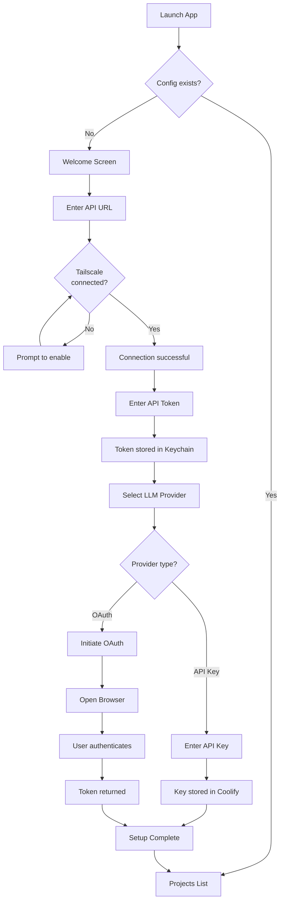
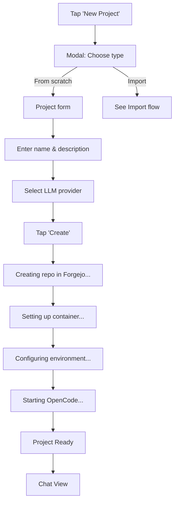
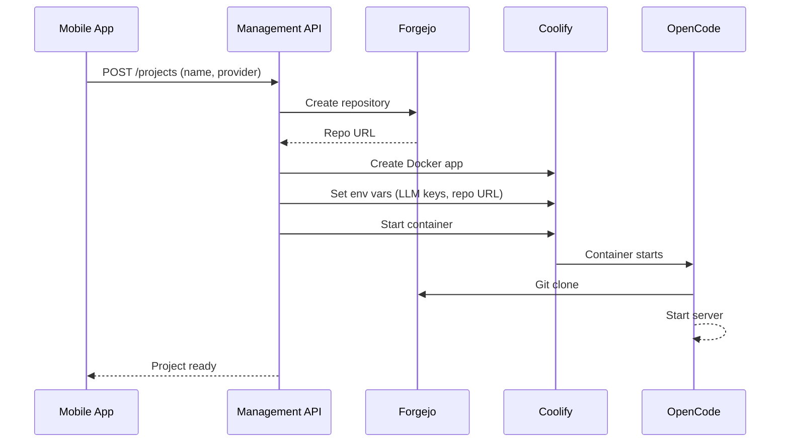
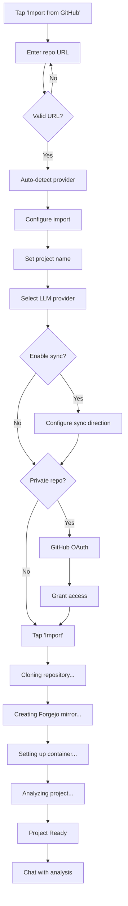
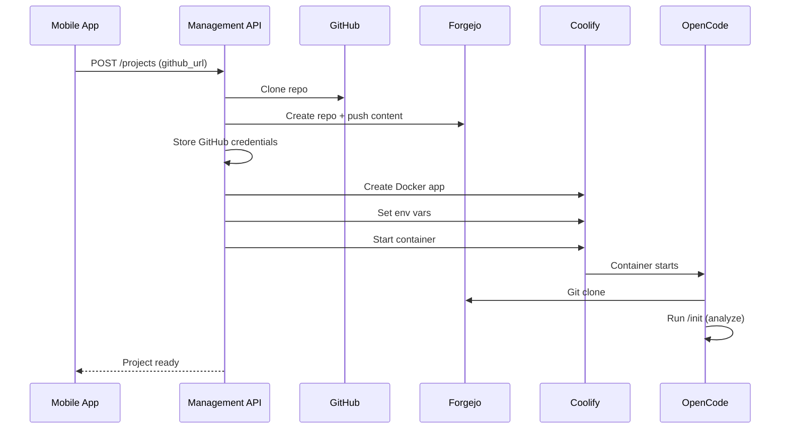
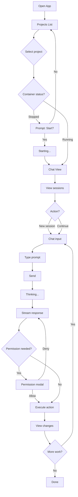

# User Journey

Detailed user flows and interactions for the Portable Command Center mobile application.

---

## Table of Contents

- [Personas](#personas)
- [User Journeys](#user-journeys)
  - [First-Time Setup](#first-time-setup)
  - [Create New Project (From Scratch)](#create-new-project-from-scratch)
  - [Import Project from GitHub](#import-project-from-github)
  - [Work on Existing Project](#work-on-existing-project)
  - [Configure LLM Provider](#configure-llm-provider)
  - [Sync Changes to GitHub](#sync-changes-to-github)
  - [Monitor Background Tasks](#monitor-background-tasks)
- [Screen Flows](#screen-flows)
- [Edge Cases](#edge-cases)

---

## Personas

### Primary User: Solo Developer / Founder

- **Name**: Alex
- **Role**: One-person company founder
- **Goal**: Manage AI-assisted development from anywhere
- **Context**: Uses phone during commute, lunch breaks, or when away from desk
- **Technical Level**: Comfortable with Git, APIs, and command line

### Usage Patterns

| Scenario | Duration | Actions |
|----------|----------|---------|
| Quick check | 1-2 min | Check task status, review AI output |
| Code review | 5-10 min | Review changes, approve/reject, give feedback |
| Start task | 2-5 min | Create session, describe task, let AI work |
| Project setup | 10-15 min | Create project, configure, initial prompt |

---

## User Journeys

### First-Time Setup

**Goal**: Connect mobile app to infrastructure and configure first LLM provider.



**Screens:**
1. Welcome / Onboarding
2. Connect to Server
3. Authentication
4. LLM Provider Selection
5. API Key Entry / OAuth Flow
6. Setup Complete

---

### Create New Project (From Scratch)

**Goal**: Create a new empty project and start working with OpenCode.



**Background Actions (Management API):**



**Screens:**
1. Projects List → New Project Modal
2. Project Creation Form
3. Creation Progress
4. Project Chat (empty)

---

### Import Project from GitHub

**Goal**: Import an existing GitHub repository into Forgejo and set up OpenCode.



**Background Actions (Management API):**



**Screens:**
1. New Project Modal → Import Tab
2. Repository URL Input
3. Import Configuration
4. GitHub OAuth (if needed)
5. Import Progress
6. Project Chat (with analysis)

---

### Work on Existing Project

**Goal**: Open a project and interact with OpenCode to make changes.



**Project Status Indicators:**
- 🟢 Running (container active)
- 🟡 Starting (container booting)  
- 🔴 Stopped (container off)
- ⚪ Unknown (no connection)

**Screens:**
1. Projects List
2. Project Chat (sessions list)
3. Active Chat Session
4. Permission Request Modal
5. Changes Diff View

---

### Configure LLM Provider

**Goal**: Add or change LLM provider credentials.

```
┌─────────────────────────────────────────────────────────────────┐
│                   CONFIGURE LLM PROVIDER                        │
└─────────────────────────────────────────────────────────────────┘

1. OPEN SETTINGS → "LLM PROVIDERS"
   └─► List of configured providers:
       • OpenRouter ✓ (default)
       • Anthropic ✓
       • GitHub Copilot (not configured)
       • + Add Provider

2. TAP PROVIDER TO CONFIGURE

   ─────────────────────────────────────────
   FLOW A: API KEY PROVIDER (OpenRouter, OpenAI, etc.)
   ─────────────────────────────────────────

   2a. TAP "OpenRouter" or "Add Provider"
       └─► Provider config screen

   3a. ENTER API KEY
       ├─► Input field for API key
       ├─► "Get API Key" link to provider's website
       └─► Tap "Save"

   4a. VALIDATION
       ├─► App tests key with provider API
       ├─► Success: "Provider configured ✓"
       └─► Failure: "Invalid API key"

   ─────────────────────────────────────────
   FLOW B: OAUTH PROVIDER (GitHub Copilot)
   ─────────────────────────────────────────

   2b. TAP "GitHub Copilot"
       └─► Provider config screen shows "Authenticate with GitHub"

   3b. TAP "AUTHENTICATE"
       ├─► App generates device code via OAuth proxy
       └─► Shows:
           "Enter code: 8F43-6FCF"
           "at github.com/login/device"
           [Open Browser]

   4b. USER AUTHENTICATES
       ├─► Opens browser (in-app or external)
       ├─► Enters code on GitHub
       ├─► Grants Copilot access
       └─► Returns to app

   5b. APP POLLS FOR TOKEN
       ├─► OAuth proxy polls GitHub
       ├─► Token received
       └─► "GitHub Copilot configured ✓"

   ─────────────────────────────────────────
   FLOW C: OAUTH PROVIDER (Anthropic Claude Pro/Max)
   ─────────────────────────────────────────

   2c. TAP "Anthropic" → "Claude Pro/Max"
       └─► Shows auth options:
           • "API Key" (manual)
           • "Claude Pro/Max" (OAuth)

   3c. TAP "CLAUDE PRO/MAX"
       ├─► App opens Anthropic OAuth URL
       └─► User authenticates in browser

   4c. CALLBACK
       ├─► Anthropic redirects to app deep link
       ├─► App extracts token
       └─► "Anthropic Claude Pro configured ✓"

3. SET DEFAULT PROVIDER
   ├─► Tap star icon next to provider
   └─► "Default provider: OpenRouter"

4. PER-PROJECT OVERRIDE
   ├─► In project settings
   └─► "LLM Provider" dropdown shows all configured providers
```

**Screens:**
1. Settings → LLM Providers
2. Provider Configuration
3. API Key Input
4. OAuth Device Code Display
5. OAuth Browser (WebView or external)
6. Success Confirmation

---

### Sync Changes to GitHub

**Goal**: Push changes made by OpenCode back to the original GitHub repository.

```
┌─────────────────────────────────────────────────────────────────┐
│                    SYNC TO GITHUB                               │
└─────────────────────────────────────────────────────────────────┘

1. OPEN PROJECT → "SYNC" BUTTON
   └─► Sync status panel shows:
       • Last sync: 2 hours ago
       • Local changes: 5 commits ahead
       • Remote changes: 0 commits behind

2. TAP "PUSH TO GITHUB"
   ├─► Confirmation: "Push 5 commits to GitHub?"
   │   Shows commit messages preview
   └─► User confirms

3. SYNC IN PROGRESS
   ├─► "Pushing changes..."
   ├─► Progress indicator
   └─► If conflict:
       ├─► "Conflict detected"
       ├─► Options:
       │   • "Pull and merge"
       │   • "Force push" (overwrites remote)
       │   • "Cancel"
       └─► User selects resolution

4. SYNC COMPLETE
   └─► "Successfully synced to GitHub ✓"
       "5 commits pushed"

   BACKGROUND ACTIONS (Management API):
   ├─► Fetch latest from Forgejo
   ├─► Push to GitHub using stored credentials
   └─► Update sync status in database
```

**Screens:**
1. Project View → Sync Panel
2. Sync Confirmation
3. Sync Progress
4. Conflict Resolution (if needed)
5. Sync Complete

---

### Monitor Background Tasks

**Goal**: Check on tasks running while away from the app.

```
┌─────────────────────────────────────────────────────────────────┐
│                   MONITOR BACKGROUND TASKS                      │
└─────────────────────────────────────────────────────────────────┘

1. RECEIVE PUSH NOTIFICATION
   └─► "✅ my-awesome-app: Task complete"
       OR
       "⚠️ my-awesome-app: Needs input"

2. TAP NOTIFICATION
   └─► App opens directly to relevant session

3. REVIEW RESULTS
   ├─► See complete chat history
   ├─► Review all changes made
   └─► Continue conversation if needed

4. ALTERNATIVE: OPEN APP MANUALLY
   └─► Dashboard shows:
       ├─► Active tasks (with live status)
       ├─► Completed tasks (last 24h)
       └─► Tasks needing attention
           • Permission requests
           • Errors
           • Questions from AI
```

**Screens:**
1. Push Notification (OS)
2. Dashboard with task status
3. Session view with results

---

## Screen Flows

### Main Navigation

```
┌─────────────────────────────────────────────────────────────────┐
│                                                                 │
│  ┌─────────┐   ┌─────────┐   ┌─────────┐   ┌─────────┐         │
│  │Projects │   │ Servers │   │Activity │   │Settings │         │
│  │  List   │   │ Status  │   │  Feed   │   │         │         │
│  └────┬────┘   └────┬────┘   └────┬────┘   └────┬────┘         │
│       │             │             │             │               │
│       ▼             ▼             ▼             ▼               │
│  ┌─────────┐   ┌─────────┐   ┌─────────┐   ┌─────────┐         │
│  │ Project │   │ Server  │   │ Session │   │  LLM    │         │
│  │  Chat   │   │ Detail  │   │ Detail  │   │Providers│         │
│  └────┬────┘   └─────────┘   └─────────┘   └─────────┘         │
│       │                                                         │
│       ▼                                                         │
│  ┌─────────┐                                                    │
│  │ Session │                                                    │
│  │Messages │                                                    │
│  └─────────┘                                                    │
│                                                                 │
└─────────────────────────────────────────────────────────────────┘
```

### Project Chat Flow

```
┌─────────────────────────────────────────────────────────────────┐
│                         PROJECT CHAT                            │
├─────────────────────────────────────────────────────────────────┤
│  ┌─────────────────────────────────────────────────────────┐    │
│  │ < Back    my-awesome-app                    ⚙️ ↗️ 🔄    │    │
│  └─────────────────────────────────────────────────────────┘    │
│                                                                 │
│  ┌─────────────────────────────────────────────────────────┐    │
│  │ Sessions                                                │    │
│  │ ┌─────────────────────────────────────────────────────┐ │    │
│  │ │ Today                                               │ │    │
│  │ │ • Add user authentication          🟢 Complete     │ │    │
│  │ │ • Fix database connection          🟢 Complete     │ │    │
│  │ │                                                     │ │    │
│  │ │ Yesterday                                           │ │    │
│  │ │ • Set up project structure         🟢 Complete     │ │    │
│  │ └─────────────────────────────────────────────────────┘ │    │
│  └─────────────────────────────────────────────────────────┘    │
│                                                                 │
│  ┌─────────────────────────────────────────────────────────┐    │
│  │ + New Session                                           │    │
│  └─────────────────────────────────────────────────────────┘    │
│                                                                 │
│  ┌─────────────────────────────────────────────────────────┐    │
│  │ What would you like to work on?                    📎  │    │
│  └─────────────────────────────────────────────────────────┘    │
└─────────────────────────────────────────────────────────────────┘
```

---

## Edge Cases

### No Network Connection

```
User opens app → No Tailscale connection
├─► Show cached project list (read-only)
├─► Display "Offline" banner
├─► Queue any actions for when online
└─► Retry connection in background
```

### Container Crashed

```
User opens project → Container not responding
├─► Show error: "Project unavailable"
├─► Options:
│   • "Restart" (attempts container restart)
│   • "View Logs" (fetch recent logs)
│   • "Contact Support"
└─► Auto-retry with exponential backoff
```

### OAuth Token Expired

```
User sends prompt → 401 Unauthorized
├─► Detect token expiration
├─► Prompt: "Session expired. Re-authenticate?"
├─► Re-run OAuth flow
└─► Retry original request
```

### Forgejo/GitHub Sync Conflict

```
User pushes to GitHub → Conflict
├─► Show conflict details
├─► Options:
│   • View conflicting changes
│   • Pull latest first
│   • Force push (override)
│   • Cancel and resolve manually
└─► Guide user through resolution
```

### Long-Running Task

```
User starts complex task → Takes > 5 minutes
├─► Show progress indicator
├─► "This may take a while. You can close the app."
├─► Background task continues on server
├─► Push notification when done
└─► Deep link brings user back to results
```

---

*Document created: December 2024*
*Last updated: December 2024*
