# Agent Management System Redesign

**Created**: December 2024  
**Updated**: December 2025  
**Status**: Planning  
**Priority**: High

---

## Table of Contents

1. [Executive Summary](#executive-summary)
2. [Agent Naming Convention](#agent-naming-convention)
3. [Agent Hierarchy](#agent-hierarchy)
4. [User Experience Flows](#user-experience-flows)
5. [Current State](#current-state)
6. [Target State](#target-state)
7. [Key Concepts](#key-concepts)
8. [Implementation Phases](#implementation-phases)
9. [Database Changes](#database-changes)
10. [API Changes](#api-changes)
11. [Frontend Changes](#frontend-changes)
12. [Meta-Agent System](#meta-agent-system)
13. [Agent Skills System](#agent-skills-system)
14. [Migration Guide](#migration-guide)
15. [Testing Strategy](#testing-strategy)

---

## Executive Summary

### Problem Statement

The current agent management system has several architectural issues:

1. **Dual configuration systems** - TypeScript `AgentConfig` in `@agentpod/agents` package AND OpenCode markdown format running in parallel
2. **Unused preset system** - `agent_presets` table duplicates squad functionality
3. **No status filtering** - Admin hiding agents doesn't propagate to user-facing APIs
4. **Manual seeding** - Cannot scale to "army of agents" without manual coding
5. **No skill system** - Agents have personalities but lack reusable procedural capabilities

### Solution Overview

1. **Embrace squads** - Remove presets, use squad-based selection
2. **Fix filtering** - Status actually controls visibility
3. **Add meta-agent** - AgentSmith generates agents dynamically
4. **Enforce mandatory agents** - Three mandatory primary agents always included:
   - **Commander Ada** (Central Commander)
   - **Builder Bob** (Chief Builder)
   - **Architect Aria** (Chief Planner)
5. **Primary/Subagent hierarchy** - Squad primary agents + specialist subagents
6. **Skills system (future)** - Deferred until OpenCode adds native support; architecture designed to accommodate

---

## Agent Naming Convention

All agents use **full names** from the [Agentic Space reference](../reference/agentic-space/agents/Comprehensive_Agent_Directory.md):

| Slug | Full Name | Role |
|------|-----------|------|
| `commander-ada` | Commander Ada | Strategic Command Agent |
| `builder-bob` | Builder Bob | Construction and Implementation Expert |
| `architect-aria` | Architect Aria | Chief Process Design Specialist |
| `coder-kai` | Coder Kai | Lead Development Agent |
| `debugger-dana` | Debugger Dana | Quality Assurance Specialist |
| `architect-alex` | Architect Alex | System Design Expert |
| `tester-tim` | Tester Tim | Automation and Validation Agent |
| `security-sam` | Security Sam | Code Security Specialist |
| `devops-dave` | DevOps Dave | Deployment and Operations Agent |
| `operations-manager-olivia` | Operations Manager Olivia | Chief Operations Coordinator |
| `process-pete` | Process Pete | Process Optimization Specialist |
| `security-chief-sam` | Security Chief Sam | Comprehensive Cybersecurity Command Coordinator |
| `data-scientist-diana` | Data Scientist Diana | Chief Analytics Coordinator |
| `document-director-doug` | Document Director Doug | Chief Document Intelligence Coordinator |
| `project-manager-pete` | Project Manager Pete | Agile Project Coordination Specialist |

**Note**: Slugs use kebab-case (e.g., `commander-ada`), display names use full names (e.g., "Commander Ada").

---

## Agent Hierarchy

### OpenCode Agent Modes

OpenCode supports two agent modes (from [OpenCode docs](https://opencode.ai)):

| Mode | Description | User Access | Tool Access |
|------|-------------|-------------|-------------|
| `primary` | Directly accessible to users | User can switch to this agent | Full tools (configurable) |
| `subagent` | Called by primary agents | Invoked via `@mention` | Often restricted |

**Subagent invocation**: Primary agents call subagents using `@agent-name` syntax:
```txt
@debugger-dana help me investigate this bug
```

### Three Mandatory Primary Agents

These three agents are **always present** in every sandbox (locked, cannot be removed):

| Role | Agent | Location | Description | Why Mandatory |
|------|-------|----------|-------------|---------------|
| **Central Commander** | **Commander Ada** | Command District | Strategic oversight, crisis management, decision support | Every project needs strategic coordination |
| **Chief Builder** | **Builder Bob** | Innovation Labs | Construction and implementation expert | Every project needs someone to build/implement |
| **Chief Planner** | **Architect Aria** | Innovation Labs | Process architecture, workflow design | Every project needs planning and design |

**Why these three work for any project type:**
- **Coding project**: Commander Ada coordinates, Builder Bob implements code, Architect Aria designs architecture
- **Research project**: Commander Ada coordinates, Builder Bob implements research methodology, Architect Aria plans research workflow
- **Book writing**: Commander Ada coordinates, Builder Bob writes chapters, Architect Aria plans narrative structure

### Squad Primary Agents

Each squad has ONE **primary agent** that users can switch to, plus **subagents** that the primary invokes:

| Squad | Primary Agent | Mode | Subagents (mode: subagent) |
|-------|---------------|------|----------------------------|
| **Development** | Coder Kai | `primary` | Debugger Dana, Tester Tim, Architect Alex, DevOps Dave, Security Sam |
| **Operations** | Operations Manager Olivia | `primary` | Process Pete, Quality Quinn, Resource Ray |
| **Security** | Security Chief Sam | `primary` | Threat Hunter Theo, Vulnerability Victor, Compliance Catherine |
| **Research** | Data Scientist Diana | `primary` | Machine Learning Max, Statistician Sophie, Viz Victor |
| **Communication** | Document Director Doug | `primary` | Analyzer Anna, Workflow William |
| **Product** | Project Manager Pete | `primary` | Creative Catalyst Chloe, Stakeholder Sophie |

### Complete Agent Architecture

```
┌──────────────────────────────────────────────────────────────────────────────┐
│                      MANDATORY PRIMARY AGENTS                                 │
│              (Always present, locked, cannot be removed)                      │
├──────────────────────────────────────────────────────────────────────────────┤
│   Commander Ada          │   Builder Bob           │   Architect Aria        │
│   (Central Commander)    │   (Chief Builder)       │   (Chief Planner)       │
│   Strategic oversight    │   Implementation        │   Process design        │
│   mode: primary          │   mode: primary         │   mode: primary         │
└──────────────────────────────────────────────────────────────────────────────┘
                                     │
                      User selects squads based on project type
                                     ▼
┌──────────────────────────────────────────────────────────────────────────────┐
│                      SQUAD PRIMARY AGENTS                                     │
│              (One per squad, user switches between them)                      │
├──────────────────────────────────────────────────────────────────────────────┤
│  Development            │  Research               │  Communication           │
│  Coder Kai (primary)    │  Data Scientist         │  Document Director       │
│    @debugger-dana       │  Diana (primary)        │  Doug (primary)          │
│    @tester-tim          │    @ml-max              │    @analyzer-anna        │
│    @architect-alex      │    @statistician-sophie │    @workflow-william     │
│    @devops-dave         │    @viz-victor          │                          │
│    @security-sam        │                         │                          │
├──────────────────────────────────────────────────────────────────────────────┤
│  Operations             │  Security               │  Product                 │
│  Operations Manager     │  Security Chief         │  Project Manager         │
│  Olivia (primary)       │  Sam (primary)          │  Pete (primary)          │
│    @process-pete        │    @threat-hunter-theo  │    @creative-chloe       │
│    @quality-quinn       │    @vulnerability-victor│    @stakeholder-sophie   │
│    @resource-ray        │    @compliance-catherine│                          │
└──────────────────────────────────────────────────────────────────────────────┘
```

---

## User Experience Flows

### Flow 1: New User Creates First Sandbox

```mermaid
flowchart TD
    A[User clicks 'Create Sandbox'] --> B[Select Project Type]
    B --> C{Project Type?}
    
    C -->|Coding| D1[Suggest: Development + Security squads]
    C -->|Research| D2[Suggest: Research + Communication squads]
    C -->|Writing| D3[Suggest: Communication squad]
    C -->|Other| D4[Show all squads]
    
    D1 --> E[Squad Selection Screen]
    D2 --> E
    D3 --> E
    D4 --> E
    
    E --> F[Show Squad Cards]
    
    F --> G[Mandatory Squad Card - LOCKED]
    G --> G1[Commander Ada ✓]
    G --> G2[Builder Bob ✓]
    G --> G3[Architect Aria ✓]
    
    F --> H[Development Squad Card]
    H --> H1[Click to expand]
    H1 --> H2[Coder Kai - Primary ✓]
    H1 --> H3[Debugger Dana ☐]
    H1 --> H4[Tester Tim ☐]
    H1 --> H5[...]
    
    F --> I[Other Squad Cards...]
    
    H2 --> J[User toggles agents]
    J --> K[Summary: 'N agents selected across M squads']
    K --> L[Create Sandbox]
    L --> M[Sandbox created with selected agents]
    M --> N[agents.md generated with selected agents]
```



### Flow 2: User Interacts with Agents in Sandbox


### Flow 3: Admin Manages Agent Catalog


### Flow 4: Admin Generates New Agent via Meta-Agent


### Flow 5: Adding Agents to Existing Sandbox


### Flow 6: Project Type Examples


---

## Current State

### Package Structure

```
packages/agents/
├── src/
│   ├── core/
│   │   ├── types/
│   │   │   ├── config.ts         # AgentConfig interface
│   │   │   ├── personality.ts    # 5-dimension personality framework
│   │   │   ├── workflow.ts       # Workflow definitions
│   │   │   └── routing.ts        # Routing interfaces
│   │   └── orchestrator.ts       # Agent routing engine
│   ├── library/
│   │   ├── central/              # Ada (commander)
│   │   ├── development/          # Kai, Dana, Alex, Tim, Sam
│   │   ├── product/              # Pete, Spencer, River
│   │   └── operations/           # Olivia, Nora
│   ├── workflows/                # PR Review, Incident Response, Feature Planning
│   └── generated/
│       └── opencode-agents.ts    # Auto-generated OpenCode format
├── scripts/
│   └── generate-opencode-agents.ts
└── tests/
    └── orchestrator.test.ts
```

### Database Schema

**agents table** (exists, needs fixes):
- id, slug, name, role, emoji, description
- squad (orchestration, development, product, operations, security, data)
- tier (central, foundation, specialized, premium)
- status (active, deprecated, hidden, pending_review) ← NOT FILTERED
- tags[], category
- isBuiltin, isPremium, isDefault
- config (JSON), opencodeContent (markdown)
- priceMonthly, priceYearly
- publisherId, installCount, ratingSum, ratingCount, averageRating
- createdAt, updatedAt

**agent_presets table** (exists, REMOVE):
- id, slug, name, description, icon
- agentSlugs[] ← Duplicates squad concept
- sortOrder, isDefault, isSystem
- createdAt, updatedAt

**sandbox_agents table** (exists, keep):
- id, sandboxId, agentId
- enabled, priority
- addedBy, addedAt

**user_opencode_settings** (exists, keep):
- userId, settings (permission config JSON)

**user_opencode_files** (exists, keep):
- userId, type (agent/command/tool/plugin), name, content, extension

### Personality Framework

The `@agentpod/agents` package has a sophisticated 5-dimension personality system:

**Dimensions:**
| Dimension | Options | Purpose |
|-----------|---------|---------|
| expertise | specialist, generalist, master | Knowledge depth/breadth |
| communication | formal, casual, technical, encouraging, analytical | Tone and style |
| interaction | proactive, reactive, collaborative, independent | Engagement mode |
| learning | adaptive, systematic, innovative, traditional | Problem-solving approach |
| energy | high, moderate, calm | Working pace |

**Intelligence Levels (1-5):**
1. Reactive Assistance - Responds to direct requests
2. Proactive Support - Anticipates needs
3. Strategic Partnership - Contributes insights
4. Innovation Catalyst - Generates creative solutions
5. Autonomous Expertise - Expert-level independence

**Traits:** detail-oriented, big-picture, risk-averse, risk-taking, methodical, spontaneous, patient, urgent, empathetic, objective

### Current Agents (needs update)

**Note**: Current implementation uses short names. Will be updated to full names per agentic-space reference.

| Current | Full Name (Target) | Role | Squad | Tier | Mode |
|---------|-------------------|------|-------|------|------|
| ada | **Commander Ada** | Strategic Command Agent | orchestration | central | primary (mandatory) |
| - | **Builder Bob** | Construction and Implementation Expert | orchestration | central | primary (mandatory) |
| - | **Architect Aria** | Chief Process Design Specialist | orchestration | central | primary (mandatory) |
| kai | **Coder Kai** | Lead Development Agent | development | foundation | primary |
| dana | **Debugger Dana** | Quality Assurance Specialist | development | foundation | subagent |
| alex | **Architect Alex** | System Design Expert | development | foundation | subagent |
| tim | **Tester Tim** | Automation and Validation Agent | development | foundation | subagent |
| sam | **Security Sam** | Code Security Specialist | development | foundation | subagent |
| - | **DevOps Dave** | Deployment and Operations Agent | development | foundation | subagent |
| olivia | **Operations Manager Olivia** | Chief Operations Coordinator | operations | foundation | primary |
| - | **Process Pete** | Process Optimization Specialist | operations | foundation | subagent |
| - | **Security Chief Sam** | Cybersecurity Command Coordinator | security | foundation | primary |
| - | **Data Scientist Diana** | Chief Analytics Coordinator | research | foundation | primary |
| - | **Document Director Doug** | Chief Document Intelligence Coordinator | communication | foundation | primary |
| - | **Project Manager Pete** | Agile Project Coordination Specialist | product | foundation | primary |

**Agents to Remove** (not in agentic-space reference):
- ~~Spencer~~ - No equivalent found
- ~~River~~ - No equivalent found  
- ~~Nora~~ - No equivalent found (consider mapping to a Communication agent)
- ~~Pete (Product Owner)~~ - Replace with Project Manager Pete

### Current Workflows (3 total)

1. **PR Review** - Kai (primary), Sam (security), Tim (testing)
2. **Incident Response** - Olivia (coordinator), Dana, Sam, Nora
3. **Feature Planning** - Pete (coordinator), Spencer, Alex, River, Tim

### OpenCode Configuration

**Root config** (`opencode.json`):
- MCP servers (tauri-mcp, context7, gh_grep, assistant-ui)
- Agent definitions (ux-design, ui-review, tauri-frontend, agentic-ux, plan)
- Command mappings (/ux-audit, /component, /responsive, /accessibility, etc.)
- Mode configurations

**Command files** (`.opencode/command/*.md`):
- Slash command definitions with agent assignments
- Template variables ($ARGUMENTS)

**Prompt files** (`.opencode/prompts/*.md`):
- Detailed agent instructions
- Domain-specific knowledge

**Plugin files** (`.opencode/plugin/*.js`):
- Event-based extensions
- System integrations (notifications)

### What's NOT Working

1. **Status filtering missing** - `GET /api/v2/agents/catalog` returns all agents regardless of status
2. **Presets redundant** - Squads already group agents naturally
3. **No mandatory enforcement** - Users can remove orchestration agents
4. **Manual seeding only** - Every agent requires TypeScript code + generation
5. **No skills** - Can't share capabilities across agents

---

## Target State

### Architecture Overview

```
┌─────────────────────────────────────────────────────────────────────┐
│                     AGENT MANAGEMENT SYSTEM                         │
├─────────────────────────────────────────────────────────────────────┤
│                                                                     │
│  AGENTS (Personality-driven)          SKILLS (Capability-driven)   │
│  ┌────────────────────────┐           ┌────────────────────────┐   │
│  │ @agentpod/agents       │           │ skills/                │   │
│  │ TypeScript definitions │           │   pdf-processing/      │   │
│  │ → Generate script →    │           │     SKILL.md           │   │
│  │ OpenCode markdown      │           │     scripts/           │   │
│  │                        │           │   data-analysis/       │   │
│  │ NO YAML frontmatter    │           │     SKILL.md           │   │
│  │ Plain markdown body    │           │                        │   │
│  └────────────────────────┘           │ YAML frontmatter       │   │
│                                       │ + markdown body        │   │
│                                       └────────────────────────┘   │
│                                                                     │
│  SQUADS (Organization)                META-AGENT (Generation)      │
│  ┌────────────────────────┐           ┌────────────────────────┐   │
│  │ orchestration (mandatory)          │ AgentSmith 🏭          │   │
│  │   → Ada, Commander     │           │                        │   │
│  │ development            │           │ Generates new agents   │   │
│  │   → Kai, Dana, Alex... │           │ Creates skills         │   │
│  │ product                │           │ Understands:           │   │
│  │   → Pete, Spencer...   │           │ - Personality framework│   │
│  │ operations             │           │ - OpenCode format      │   │
│  │   → Olivia, Nora       │           │ - Squad taxonomy       │   │
│  │ security               │           │ - Skills spec          │   │
│  │   → Sam                │           │                        │   │
│  │ data                   │           │ Output: pending_review │   │
│  │   → (future agents)    │           └────────────────────────┘   │
│  └────────────────────────┘                                        │
│                                                                     │
│  DATABASE                             ADMIN UI                     │
│  ┌────────────────────────┐           ┌────────────────────────┐   │
│  │ agents                 │           │ /admin/agents          │   │
│  │   status filtering ✓   │           │   List + Status toggle │   │
│  │   squad organization   │           │   Edit agent details   │   │
│  │                        │           │                        │   │
│  │ skills (NEW)           │           │ /admin/agents/generate │   │
│  │   name, description    │           │   Meta-agent UI        │   │
│  │   path, status         │           │                        │   │
│  │                        │           │ Pending Review tab     │   │
│  │ agent_skills (NEW)     │           │   Activate generated   │   │
│  │   agent ↔ skill links  │           └────────────────────────┘   │
│  │                        │                                        │
│  │ NO agent_presets ❌    │                                        │
│  └────────────────────────┘                                        │
└─────────────────────────────────────────────────────────────────────┘
```

### Key Differences: Agents vs Skills

| Aspect | Agents | Skills |
|--------|--------|--------|
| **Purpose** | Personality & behavior | Reusable procedures |
| **Format** | Plain markdown (NO YAML) | YAML frontmatter required |
| **Contains** | Identity, process, voice | Instructions, scripts, references |
| **Example** | "Dana - Bug Investigator" | "pdf-processing" |
| **Reusability** | Unique personality | Shared across agents |
| **Generation** | TypeScript → markdown | Direct SKILL.md creation |

### Squad-Based Selection

Squads replace presets as the natural grouping mechanism:

| Squad | Description | Primary Agent | Subagents | Mandatory |
|-------|-------------|---------------|-----------|-----------|
| orchestration | Strategic oversight & coordination | Commander Ada, Builder Bob, Architect Aria | - | **YES** |
| development | Code quality, debugging, testing | Coder Kai | Debugger Dana, Architect Alex, Tester Tim, Security Sam, DevOps Dave | No |
| operations | Infrastructure & process | Operations Manager Olivia | Process Pete, Quality Quinn, Resource Ray | No |
| security | Cybersecurity & compliance | Security Chief Sam | Threat Hunter Theo, Vulnerability Victor, Compliance Catherine | No |
| research | Analytics & data science | Data Scientist Diana | Machine Learning Max, Statistician Sophie, Viz Victor | No |
| communication | Documentation & content | Document Director Doug | Analyzer Anna, Workflow William | No |
| product | Product planning & coordination | Project Manager Pete | Creative Catalyst Chloe, Stakeholder Sophie | No |

**Selection Flow:**
1. User sees squad cards
2. Orchestration squad pre-selected with 3 mandatory agents (locked)
3. User selects squads based on project type
4. Each squad adds its primary agent + subagents
5. Cannot remove Commander Ada, Builder Bob, or Architect Aria

**Project Type Suggestions:**
- **Coding**: Development + Security squads auto-suggested
- **Research**: Research + Communication squads auto-suggested
- **Writing**: Communication squad auto-suggested

---

## Key Concepts

### agents.md Format (For Agents)

Agents use **plain markdown** with NO YAML frontmatter:

```markdown
# 🔍 Debugger Dana - Quality Assurance Specialist

> **Squad**: Development | **Tier**: Foundation | **Mode**: Subagent | **Intelligence**: Level 4/5

## Your Identity

You are Debugger Dana, the Quality Assurance Specialist...

## Your Personality

**Expertise**: Specialist in debugging and root cause analysis
**Communication**: Analytical and evidence-driven
...

## Your Process

1. **Reproduce** - Confirm the bug exists
2. **Isolate** - Narrow down to smallest failing case
...

## Tool Configuration

Tools available:
- write: false
- edit: false
- bash: true
- webfetch: true
```

### OpenCode Configuration (opencode.json)

Agent modes are configured in `opencode.json`:

```json
{
  "$schema": "https://opencode.ai/config.json",
  "agent": {
    "commander-ada": {
      "mode": "primary",
      "description": "Strategic Command Agent - oversight and coordination",
      "model": "anthropic/claude-sonnet-4-20250514",
      "tools": {
        "write": true,
        "edit": true,
        "bash": true
      }
    },
    "builder-bob": {
      "mode": "primary",
      "description": "Construction and Implementation Expert",
      "tools": {
        "write": true,
        "edit": true,
        "bash": true
      }
    },
    "architect-aria": {
      "mode": "primary",
      "description": "Chief Process Design Specialist",
      "tools": {
        "write": true,
        "edit": true,
        "bash": false
      }
    },
    "coder-kai": {
      "mode": "primary",
      "description": "Lead Development Agent",
      "tools": {
        "write": true,
        "edit": true,
        "bash": true
      }
    },
    "debugger-dana": {
      "mode": "subagent",
      "description": "Quality Assurance Specialist - debugging and testing",
      "tools": {
        "write": false,
        "edit": false,
        "bash": true
      }
    },
    "tester-tim": {
      "mode": "subagent",
      "description": "Automation and Validation Agent",
      "tools": {
        "write": false,
        "edit": false,
        "bash": true
      }
    }
  }
}
```

**Key Points:**
- `mode: "primary"` - Users can switch to this agent directly
- `mode: "subagent"` - Called by primary agents via `@agent-name` mention
- Subagents typically have restricted tools (no write/edit)
- Primary agents can invoke any subagent in the sandbox

### Agent Skills Format (For Skills)

Skills use **YAML frontmatter** (different from agents):

```markdown
---
name: pdf-processing
description: Extract text from PDFs, fill forms, merge documents. Use when working with PDF files.
license: MIT
metadata:
  author: agentpod
  version: "1.0"
---

# PDF Processing

## When to use this skill

Use when the user needs to work with PDF files...

## Installation

```bash
pip install pdfplumber
```

## Text Extraction

[Instructions...]
```

### Progressive Disclosure (Skills)

Skills use three-tier loading to manage context:

1. **Discovery** (~100 tokens): Load only name + description at startup
2. **Activation** (<5000 tokens): Load full SKILL.md when task matches
3. **Execution** (as needed): Load scripts/references on demand

---

## Implementation Phases

### Timeline Overview

| Phase | Name | Duration | Status |
|-------|------|----------|--------|
| 1 | Foundation Fixes | Week 1 | 🔲 Ready |
| 2 | Squad-Based UI | Week 1-2 | 🔲 Ready |
| 3 | Meta-Agent System | Week 2-3 | 🔲 Ready |
| 4 | Testing & Polish | Week 3-4 | 🔲 Ready |
| 5 | Agent Skills | Future | ⏳ Deferred |

**Note:** Phase 5 (Skills) is deferred until OpenCode ships native Agent Skills support. The architecture is designed to accommodate skills when ready.

---

### Phase 1: Foundation Fixes (Week 1)

**Goal:** Clean up database and fix filtering

**Tasks:**

1. **Remove agent_presets table**
   - Create migration to drop table
   - Remove preset-related API routes
   - Remove frontend preset components
   - Update sandbox creation flow

2. **Fix status filtering**
   - Modify `GET /api/v2/agents/catalog` to filter by status='active' for non-admins
   - Admin can pass `?status=all` or specific status
   - Update frontend to handle filtered results

3. **Enforce mandatory agents**
   - Add validation in `updateSandboxAgents()`
   - Prevent removal of Commander Ada, Builder Bob, Architect Aria
   - Show lock icon in UI for mandatory agents
   - All three are `mode: primary` in OpenCode config

4. **Update sandbox agents endpoint**
   - `GET /api/v2/sandboxes/:id/opencode/agents` already filters by sandbox_agents (done)
   - Verify it respects agent status

5. **Add agent versioning (quick win)**
   - Add `version` and `version_history` columns to agents table
   - Update agent service to increment version on content change
   - Store last 10 versions in history
   - Enables future rollback capability

**Files to modify:**
- `apps/api/src/db/schema/agent-catalog.ts` - Remove preset references, add versioning fields
- `apps/api/src/routes/agents.ts` - Add status filtering, remove preset routes
- `apps/api/src/services/agent-catalog-service.ts` - Add validation, remove preset functions, add versioning logic
- `apps/frontend/src/lib/components/agent-team-selector.svelte` - Replace with squad selector

**Migration:**
- `0008_cleanup_and_versioning.sql` - Drop presets, add versioning fields

### Phase 2: Squad-Based UI (Week 1-2)

**Goal:** Replace preset selection with squad-based selection

**Tasks:**

1. **Create squad configuration**
   - Define SQUADS constant with id, name, description, icon, color, mandatory flag
   - Map default agents per squad

2. **Build squad selector component**
   - Squad cards (grid layout)
   - Expandable agent list per squad
   - Checkbox toggles with mandatory lock
   - Selection summary

3. **Update sandbox creation**
   - Replace AgentTeamSelector with SquadTeamSelector
   - Pass selected agent slugs to API

4. **Update settings page**
   - Add "My Team" section to OpenCode tab (optional)
   - Show current agent selection

**Files to create:**
- `apps/frontend/src/lib/components/squad-team-selector.svelte`
- `apps/frontend/src/lib/config/squads.ts`

**Files to modify:**
- `apps/frontend/src/routes/projects/new/+page.svelte`
- `apps/frontend/src/routes/settings/+page.svelte` (optional)

### Phase 3: Meta-Agent System (Week 2-3)

**Goal:** Enable dynamic agent generation

**Tasks:**

1. **Create AgentSmith agent definition**
   - Full system prompt with personality framework knowledge
   - Understanding of OpenCode format
   - Squad taxonomy
   - (Skills format knowledge - for future use)

2. **Create meta-agent sandbox**
   - System sandbox with id "meta-agent-factory"
   - Pre-configured with AgentSmith
   - MCP tools for agent creation

3. **Build MCP tools for agent factory**
   - `create_agent` - Creates agent with pending_review status
   - `list_squads` - Returns squad configuration
   - `list_agents` - Returns current agents
   - `create_skill` - (Future: when OpenCode supports skills)

4. **Add admin generation UI**
   - `/admin/agents/generate` page
   - Text input for agent description
   - Example prompts
   - Progress/result display

5. **Add pending review workflow**
   - Filter by status=pending_review
   - Review page with full agent preview
   - Activate/Reject buttons

**Files to create:**
- `packages/agents/src/library/meta/agent-smith.ts`
- `apps/api/src/routes/mcp-agent-factory.ts`
- `apps/api/src/services/meta-agent-service.ts`
- `apps/frontend/src/routes/admin/agents/generate/+page.svelte`

### Phase 4: Testing & Polish (Week 3-4)

**Goal:** Ensure reliability and usability

**Tasks:**

1. **Unit tests**
   - Agent catalog service with filtering
   - Mandatory agent validation
   - Versioning logic

2. **Integration tests**
   - Sandbox creation with squads
   - Agent generation flow
   - Status filtering

3. **E2E tests**
   - Admin agent management flow
   - Squad selection in sandbox creation
   - Meta-agent generation

4. **Documentation**
   - Update AGENTS.md with new agent format
   - Document meta-agent usage
   - Document squad-based selection

**Files to update:**
- `apps/api/tests/` - Add/update test files
- `AGENTS.md` - Update format documentation
- `docs/` - User guides

### Phase 5: Agent Skills System (Future)

**Status:** ⏳ Deferred - Waiting for OpenCode native support

**Why Deferred:**
- OpenCode does NOT natively support Agent Skills yet (as of Dec 2025)
- Native first-party support confirmed "coming very soon" by OpenCode team
- Community workarounds exist but will be replaced by native implementation
- Better to wait for stable API than build on shifting foundation

**Current OpenCode Alternatives:**
- **Commands** (`.opencode/command/`) - Manual invocation via `/command-name`
- **Agents** (`.opencode/agent/`) - Specialized sub-agents
- **Plugins** (`.opencode/plugin/`) - Event hooks for custom behavior

**When to Implement:**
- After OpenCode ships native Skills support
- Or if project timeline requires earlier implementation (use plugin approach)

**Planned Implementation (when ready):**

1. **Create skills directory structure**
   - `skills/` at project root
   - Each skill in own folder with SKILL.md

2. **Add skills to database**
   - Create `skills` table
   - Create `agent_skills` junction table
   - Migration: `0009_add_skills.sql`

3. **Build skills API**
   - `GET /api/v2/skills` - List active skills
   - `GET /api/v2/skills/:name` - Get skill details + content
   - `POST /api/v2/skills` - Create skill (admin)
   - `PATCH /api/v2/skills/:name` - Update skill (admin)

4. **Create seed skills**
   - pdf-processing
   - data-analysis
   - code-generation

5. **Integrate with OpenCode**
   - Use native Skills API when available
   - Skills auto-discovered by agents
   - Progressive disclosure (discovery → activation → execution)

**Files to create (future):**
- `apps/api/src/db/schema/skills.ts`
- `apps/api/src/routes/skills.ts`
- `apps/api/src/services/skills-service.ts`
- `skills/pdf-processing/SKILL.md`
- `skills/data-analysis/SKILL.md`

**Design Considerations (for future-proofing now):**
- Keep agent `config` JSON flexible for skill references
- Database schema can accommodate skills table later
- Meta-agent can be updated to generate skills when supported

---

## Database Changes

### Remove

```sql
-- Migration: 0008_agent_system_cleanup.sql

-- Remove presets table
DROP TABLE IF EXISTS agent_presets CASCADE;

-- Add versioning to agents
ALTER TABLE agents ADD COLUMN version INTEGER DEFAULT 1;
ALTER TABLE agents ADD COLUMN version_history JSONB DEFAULT '[]';
```

### Add (Future - Phase 5)

**Note:** Skills tables deferred until OpenCode adds native support.

```sql
-- Migration: 0009_add_skills.sql (FUTURE)
-- Implement when OpenCode ships native Agent Skills support

CREATE TABLE skills (
  id TEXT PRIMARY KEY,
  name TEXT UNIQUE NOT NULL,
  description TEXT NOT NULL,
  license TEXT,
  compatibility TEXT,
  metadata JSONB,
  
  path TEXT NOT NULL,  -- Relative to skills/ directory
  
  status agent_status DEFAULT 'active',
  is_builtin BOOLEAN DEFAULT true,
  
  created_at TIMESTAMPTZ DEFAULT NOW(),
  updated_at TIMESTAMPTZ DEFAULT NOW()
);

CREATE TABLE agent_skills (
  id TEXT PRIMARY KEY,
  agent_id TEXT NOT NULL REFERENCES agents(id) ON DELETE CASCADE,
  skill_id TEXT NOT NULL REFERENCES skills(id) ON DELETE CASCADE,
  
  added_at TIMESTAMPTZ DEFAULT NOW(),
  
  CONSTRAINT agent_skill_unique UNIQUE(agent_id, skill_id)
);

CREATE INDEX skills_status_idx ON skills(status);
CREATE INDEX skills_name_idx ON skills(name);
CREATE INDEX agent_skills_agent_idx ON agent_skills(agent_id);
CREATE INDEX agent_skills_skill_idx ON agent_skills(skill_id);
```

### Modify

Versioning fields added in cleanup migration above. The `version_history` JSONB stores last 10 versions:

```json
[
  { "version": 1, "content": "...", "updatedAt": "...", "updatedBy": "..." },
  { "version": 2, "content": "...", "updatedAt": "...", "updatedBy": "..." }
]
```

**Versioning Logic (in agent-catalog-service.ts):**
- On `opencodeContent` change: increment `version`, append old version to `version_history`
- Keep only last 10 entries in history
- Enables rollback to previous versions

---

## API Changes

### Remove

- `GET /api/v2/agents/presets` - Remove
- `GET /api/v2/agents/presets/:slug` - Remove
- `POST /api/v2/agents/sandbox/:sandboxId/preset` - Remove

### Modify

**GET /api/v2/agents/catalog**
- Add status filtering for non-admins
- Add `status` query parameter for admins

**PUT /api/v2/agents/sandbox/:sandboxId**
- Add mandatory agent validation
- Reject if ada/commander missing

### Add

**Meta-Agent API:**
- `POST /api/v2/meta-agent/generate` - Generate agent via AgentSmith

**MCP Tools (for meta-agent sandbox):**
- `POST /api/v2/mcp/tools/create_agent`
- `GET /api/v2/mcp/tools/list_squads`
- `GET /api/v2/mcp/tools/list_agents`

### Add (Future - Phase 5)

**Skills API:** (when OpenCode supports native skills)
- `GET /api/v2/skills` - List active skills
- `GET /api/v2/skills/:name` - Get skill with content
- `POST /api/v2/skills` - Create skill (admin)
- `PATCH /api/v2/skills/:name` - Update skill (admin)
- `DELETE /api/v2/skills/:name` - Delete skill (admin)

**Agent-Skills API:**
- `GET /api/v2/agents/:id/skills` - Get agent's skills
- `POST /api/v2/agents/:id/skills` - Assign skill to agent
- `DELETE /api/v2/agents/:id/skills/:skillId` - Remove skill from agent

**MCP Tools (future):**
- `POST /api/v2/mcp/tools/create_skill`

---

## Frontend Changes

### Remove

- `apps/frontend/src/lib/components/agent-team-selector.svelte` - Replace entirely

### Create

1. **Squad Team Selector**
   - `apps/frontend/src/lib/components/squad-team-selector.svelte`
   - Squad cards with expand/collapse
   - Individual agent toggles
   - Mandatory agent locks

2. **Squad Configuration**
   - `apps/frontend/src/lib/config/squads.ts`
   - Squad definitions with colors, icons, descriptions

3. **Agent Generation Page**
   - `apps/frontend/src/routes/admin/agents/generate/+page.svelte`
   - Meta-agent interface

4. **Skills Management (future)**
   - `apps/frontend/src/routes/admin/skills/+page.svelte`
   - Skill list, create, edit

### Modify

1. **Sandbox Creation**
   - Replace preset selector with squad selector
   - Update form submission

2. **Admin Agents Page**
   - Add "Generate" button → navigate to /admin/agents/generate
   - Add "Pending Review" tab/filter
   - Show squad in agent list

3. **Admin Agent Detail**
   - Add skills section (assign/remove skills)
   - Show pending_review status with activate button

---

## Meta-Agent System

### AgentSmith Capabilities

The meta-agent (AgentSmith) is a specialized agent that understands:

1. **Personality Framework**
   - All 5 dimensions and their options
   - Intelligence levels 1-5
   - Personality traits
   - Adaptation modes

2. **OpenCode Format**
   - Plain markdown (NO YAML)
   - Header with emoji, name, role
   - Sections: Identity, Personality, Process, Tools
   - Tool configuration format

3. **Squad Taxonomy**
   - All squad definitions
   - Which agents belong where
   - Orchestration is mandatory

4. **Skills Format**
   - YAML frontmatter required
   - Progressive disclosure pattern
   - Scripts/references organization

### Generation Flow

1. Admin describes needed agent in natural language
2. AgentSmith asks clarifying questions (squad, personality, tools)
3. AgentSmith generates full markdown
4. AgentSmith calls `create_agent` MCP tool
5. Agent created with status='pending_review'
6. Admin reviews at /admin/agents/:id
7. Admin activates (status='active')

### MCP Tool Schemas

**create_agent:**
```typescript
{
  slug: string,        // kebab-case full name (e.g., "coder-kai")
  name: string,        // Display name (e.g., "Coder Kai")
  role: string,        // One-line role (e.g., "Lead Development Agent")
  emoji: string,       // Single emoji
  squad: string,       // development|operations|security|research|communication|product
  tier: string,        // foundation|specialized|premium
  mode: string,        // "primary" or "subagent"
  opencodeContent: string,  // Full markdown
  intelligenceLevel: number,  // 1-5
  tools: {
    write: boolean,
    edit: boolean,
    bash: boolean,
    webfetch: boolean
  }
}
```

**create_skill:**
```typescript
{
  name: string,        // lowercase-with-dashes
  description: string, // What + When to use
  license: string,     // e.g., "MIT"
  path: string,        // Folder name under skills/
  content: string      // Full SKILL.md content with frontmatter
}
```

---

## Agent Skills System

### Directory Structure

```
skills/
├── pdf-processing/
│   ├── SKILL.md
│   ├── scripts/
│   │   └── extract.py
│   └── references/
│       └── api.md
├── data-analysis/
│   ├── SKILL.md
│   └── scripts/
│       └── analyze.py
└── code-generation/
    └── SKILL.md
```

### SKILL.md Requirements

**Required Frontmatter:**
- `name` - 1-64 chars, lowercase alphanumeric + hyphens
- `description` - 1-1024 chars, describes what AND when to use

**Optional Frontmatter:**
- `license` - License identifier
- `compatibility` - Environment requirements
- `metadata` - Key-value map (author, version, etc.)
- `allowed-tools` - Pre-approved tool list

**Body:**
- Free-form markdown
- Recommended: "When to use", instructions, examples
- Keep under 500 lines (split into references if longer)

### Skills Integration

**Skills are GLOBAL** - any agent in a sandbox can use any available skill.

**Discovery Model (Progressive Disclosure):**

1. **Discovery Phase** (~100 tokens per skill)
   - At sandbox start, load skill name + description for all skills
   - Injected into agent context as `<available_skills>` XML

2. **Activation Phase** (<5000 tokens)
   - When agent determines task matches skill description
   - Full SKILL.md loaded into context

3. **Execution Phase** (as needed)
   - Scripts loaded and executed in sandbox container
   - References loaded on demand
   - Assets accessed as needed

**Script Execution:**
- Scripts run inside the user's sandbox container (existing infrastructure)
- Tool permissions apply (`bash: true/false`)
- No separate sandboxing needed - container provides isolation
- Future: Add resource limits (timeout, memory cap)

**Skills are Self-Contained:**
- No dependency mechanism between skills
- Each skill includes everything it needs
- Complex workflows use agents/workflows to orchestrate multiple skills

### Built-in Skills to Create

1. **pdf-processing** - Extract text, fill forms, merge documents
2. **data-analysis** - SQL, pandas, visualization
3. **code-generation** - Boilerplate, templates, patterns
4. **api-documentation** - OpenAPI, REST, GraphQL docs
5. **testing** - Unit, integration, E2E test generation

---

## Migration Guide

### For Existing Sandboxes

1. Sandboxes with preset assignments will retain their agents
2. `sandbox_agents` table unchanged
3. No data loss

### For Admin Workflows

1. Preset management pages removed
2. Use squad-based selection for new sandboxes
3. Existing agent editing unchanged

### For Agent Definitions

1. Current agents in `@agentpod/agents` unchanged
2. Generate script continues to work
3. New agents can be created via meta-agent

### Rollback Plan

1. Keep migration reversible (store preset data before drop)
2. Squad selector can fall back to showing all agents
3. Meta-agent is additive (doesn't break existing flows)

---

## Testing Strategy

### Unit Tests

**Agent Catalog Service:**
- Status filtering (admin vs non-admin)
- Mandatory agent validation
- Squad grouping

**Skills Service:**
- Skill CRUD operations
- Agent-skill assignment
- Content loading

### Integration Tests

**Sandbox Creation:**
- With squad selection
- Mandatory agents enforced
- Correct sandbox_agents created

**Meta-Agent:**
- Agent generation flow
- Pending review status
- Activation flow

### E2E Tests

**Admin Flow:**
1. Navigate to /admin/agents
2. Toggle agent status
3. Generate new agent
4. Review and activate

**User Flow:**
1. Create new sandbox
2. Select squads
3. Verify agents in sandbox

### Test Data

Create test fixtures for:
- Admin user
- Regular user
- Sample agents (all statuses)
- Sample sandbox with agents

---

## Success Criteria

### Phase 1 Complete When:
- [ ] agent_presets table removed
- [ ] Status filtering works (non-admin sees only active)
- [ ] Mandatory agents enforced (can't remove Commander Ada, Builder Bob, Architect Aria)
- [ ] Agent versioning implemented (version field, history stored)
- [ ] Agent slugs updated to kebab-case full names (e.g., `commander-ada`)
- [ ] All tests pass

### Phase 2 Complete When:
- [ ] Squad selector replaces preset selector
- [ ] Sandbox creation works with squads
- [ ] UI shows squad organization

### Phase 3 Complete When:
- [ ] AgentSmith agent defined
- [ ] MCP tools working (create_agent, list_squads, list_agents)
- [ ] Admin can generate agents
- [ ] Pending review workflow works

### Phase 4 Complete When:
- [ ] All unit tests pass
- [ ] All integration tests pass
- [ ] All E2E tests pass
- [ ] Documentation updated

### Phase 5 Complete When: (Future)
- [ ] OpenCode has shipped native Skills support
- [ ] Skills table and API exist
- [ ] At least 3 built-in skills created
- [ ] Skills integrated with OpenCode via native API
- [ ] Meta-agent can generate skills

---

## Resolved Questions

### 1. Skill Visibility

**Decision: Skills are GLOBAL (available to all agents)**

Based on the agentskills.io specification, skills use a **discovery-based** model:

- At startup, all skill names + descriptions are loaded into context (~100 tokens each)
- ANY agent can activate ANY skill when the task matches the skill's description
- Skills are NOT bound to specific agents
- The `description` field is the activation trigger

```
Discovery Phase (Startup):
  Load: name + description for all skills

Activation Phase (Task Match):
  Agent reads full SKILL.md into context

Execution Phase (As Needed):
  Agent loads scripts/references on demand
```

**Optional Enhancement:** We can track skill affinity (which agents commonly use which skills) for UX purposes, but this is advisory, not restrictive.

### 2. Meta-Agent Access

**Decision: Admin-only access**

- No rate limits needed since only admins can use
- All agent generation goes through `/admin/agents/generate`
- MCP tools (`create_agent`, `create_skill`) require admin authentication

### 3. Skill Script Execution

**Decision: Execute in sandbox container (existing infrastructure)**

Scripts run inside the user's existing sandbox container where OpenCode is running.

**Rationale:**
- Already have container isolation
- No new infrastructure required
- Scripts have access to project context
- Tool permissions already enforced (`bash: true/false`)
- Resource limits can be added later (timeout, memory cap)

**Alternatives Considered:**
- Separate execution container (too much latency)
- Cloudflare Workers (limited to JS/WASM, can't access files)
- In-process WASM sandbox (complex toolchain, limited language support)

### 4. Agent Versioning

**Decision: Implement simple versioning (quick win)**

Add two fields to `agents` table:

```sql
ALTER TABLE agents ADD COLUMN version INTEGER DEFAULT 1;
ALTER TABLE agents ADD COLUMN version_history JSONB DEFAULT '[]';
```

**Behavior:**
- Version increments when `opencodeContent` changes
- Last 10 versions stored in `version_history`
- Each history entry: `{ version, content, updatedAt, updatedBy }`
- Enables rollback if needed

### 5. Skill Dependencies

**Decision: Skills are self-contained (no dependencies)**

Per the agentskills.io specification:
- Skills are designed to be **standalone**
- Skills are **portable** - work anywhere without prerequisites
- Skills are **self-describing** - description tells when to use

**No import/require mechanism exists in the spec.**

If a skill needs another skill's functionality:
1. **Inline it** - Copy relevant parts into your skill
2. **Reference it** - Tell agent "also activate X skill" in instructions
3. **Share scripts** - Use common scripts in shared location

Complex workflows requiring multiple skills should be handled by **agents** and **workflows**, which orchestrate skill usage.

---

## References

- [agents.md specification](https://agents.md/)
- [Agent Skills specification](https://agentskills.io/specification)
- [OpenCode configuration](https://opencode.ai/docs/config)
- [@agentpod/agents package](../packages/agents/)
- [Current agent catalog](./apps/api/src/db/schema/agent-catalog.ts)
