# The Agentic Intelligence Virtual Office
## A Revolutionary Human-AI Collaborative Workspace

> *"Welcome to the future of work, where artificial intelligence agents are not tools you use, but colleagues you work alongside in a shared digital reality."*

---

## 🎯 Executive Vision

The Agentic Intelligence Virtual Office represents a paradigm shift from traditional enterprise software interfaces to an immersive, collaborative workspace where AI agents and human workers operate as first-class citizens. This isn't just a user interface—it's a living, breathing digital workplace where artificial intelligence has physical presence, personality, and purpose.

### The Revolutionary Concept

Imagine walking into a virtual office where:
- **AI agents have desks, personalities, and expertise areas**
- **Meetings happen in immersive 3D spaces with both human and AI participants**
- **Data comes alive through spatial visualization and interactive environments**
- **Business processes flow through physical spaces you can walk through and optimize**
- **Knowledge workers collaborate naturally with AI colleagues using voice, gesture, and spatial interaction**

---

## 🏗️ Virtual Campus Architecture

### Overall Campus Layout

```mermaid
graph TB
    subgraph "AGENTIC INTELLIGENCE VIRTUAL CAMPUS"
        subgraph "COMMAND DISTRICT"
            ICC[Intelligence Command Center<br/>🏢 The Nerve Center]
            AMP[Agent Marketplace<br/>🏪 The Talent Exchange]
            PO[Performance Observatory<br/>🗼 The Watchtower]
        end
        
        subgraph "INNOVATION LABS"
            PDS[Process Designer Studio<br/>🔧 The Workflow Foundry]
            DW[Developer Workbench<br/>⚗️ The Code Laboratory]
            AAL[Advanced Analytics Lab<br/>🔭 The Data Observatory]
            TVL[Testing & Validation Lab<br/>🧪 The Proving Grounds]
        end
        
        subgraph "BUSINESS OPERATIONS WING"
            FCC[Financial Control Center<br/>🏦 The Treasury Vault]
            OCB[Operations Command Bridge<br/>🚢 The Bridge]
            EBR[Executive Briefing Room<br/>🎭 The War Room]
            RTIC[Real-Time Intelligence Center<br/>💓 The Pulse Chamber]
            DMS[Data Management Studio<br/>🌱 The Data Garden]
        end
        
        subgraph "SECURITY & GOVERNANCE TOWER"
            SCC[Security Command Center<br/>🏰 The Fortress]
            GD[Governance Dashboard<br/>⚖️ The Council Chamber]
            CCR[Compliance Control Room<br/>🔍 The Audit Arena]
            SAC[System Administration Console<br/>🔧 The Engine Room]
        end
        
        subgraph "DEVELOPMENT CAMPUS"
            ACC[Advanced Configuration Center<br/>🎛️ The Control Nexus]
            AMC[API Management Console<br/>🌐 The Connection Hub]
            ICT[Integration Control Tower<br/>🌉 The Bridge Builder]
        end
        
        subgraph "SUPPORT & LEARNING CENTER"
            LAC[Learning & Adoption Center<br/>🎓 The Academy]
            HSP[Help & Support Portal<br/>🤝 The Help Desk Plaza]
            SMD[Success Metrics Dashboard<br/>🏆 The Achievement Gallery]
        end
        
        subgraph "CENTRAL COLLABORATION HUB"
            CH[Collaboration Hub<br/>🏛️ The Town Square]
            IC[Insights Canvas<br/>🎨 The Art Studio]
            PS[Personalization Studio<br/>✂️ The Tailor Shop]
        end
        
        subgraph "COMMUNICATION INTELLIGENCE CHAMBER"
            CO[Communication Orchestrator<br/>📡 The Communications Tower]
            DIC[Document Intelligence Center<br/>📚 The Library of Alexandria]
            PPI[Partner Portal Interface<br/>🏛️ The Embassy]
        end
        
        subgraph "FIELD OPERATIONS STATION"
            MCC[Mobile Command Center<br/>📱 The Mobile Unit]
            FOA[Field Operations Assistant<br/>⛺ The Field Station]
        end
    end
    
    %% Flowing connections between districts
    ICC -.-> CH
    PDS -.-> CH
    FCC -.-> CH
    SCC -.-> CH
    ACC -.-> CH
    LAC -.-> CH
```

### Hybrid Architecture Design

The virtual campus combines **structured districts** with **flowing collaboration zones**:

#### 🏢 Structured Districts
- **Command District**: Strategic oversight and agent management
- **Innovation Labs**: Creative development and experimentation
- **Business Operations Wing**: Core business process execution
- **Security & Governance Tower**: Risk management and compliance
- **Development Campus**: Technical development and integration
- **Support & Learning Center**: User enablement and success
- **Central Collaboration Hub**: Cross-functional teamwork and creativity
- **Communication Intelligence Chamber**: Multi-channel communication and document management
- **Field Operations Station**: Mobile and field work support

#### 🌊 Flowing Collaboration Zones
- **Innovation Corridors**: Connecting creative and technical spaces
- **Knowledge Sharing Plazas**: Open areas for informal collaboration
- **Cross-Functional Meeting Spaces**: Dynamic environments for team projects
- **Agent Transit Networks**: Invisible pathways for AI agent movement

---

## 🤖 AI Agent Framework

### Agent as First-Class Citizens

In this virtual office, AI agents are not background processes—they are visible, interactive colleagues with:

#### Physical Presence
- **Avatar Representation**: Realistic or stylized visual representations
- **Spatial Positioning**: Agents have desks, offices, and favorite locations
- **Body Language**: Gestures, expressions, and movement patterns
- **Personal Items**: Customized workspaces reflecting their expertise

#### Distinct Personalities
- **Communication Styles**: Formal, casual, technical, empathetic
- **Expertise Domains**: Deep specialization with collaborative awareness
- **Learning Patterns**: Unique approaches to problem-solving and knowledge acquisition
- **Collaboration Preferences**: How they work best with humans and other agents

#### Professional Roles
- **Specialized Functions**: Each agent has clear responsibilities and expertise
- **Team Memberships**: Agents belong to cross-functional project teams
- **Reporting Relationships**: Clear hierarchies and collaboration patterns
- **Performance Metrics**: Agents are evaluated and continuously improved

### Example Agent Personas

#### Commander Ada - Strategic Oversight Agent
- **Location**: Intelligence Command Center
- **Personality**: Military precision with strategic thinking
- **Appearance**: Professional uniform, confident posture
- **Specialties**: Crisis management, resource allocation, strategic planning
- **Communication Style**: Clear, concise, action-oriented

#### Broker Max - Agent Marketplace Specialist
- **Location**: Agent Marketplace
- **Personality**: Enthusiastic networker with deep agent knowledge
- **Appearance**: Business casual, always moving, friendly demeanor
- **Specialties**: Agent capabilities, performance matching, user needs analysis
- **Communication Style**: Engaging, persuasive, detail-oriented

#### Architect Aria - Process Design Expert
- **Location**: Process Designer Studio
- **Personality**: Creative perfectionist with systems thinking
- **Appearance**: Architect-style dress, surrounded by holographic blueprints
- **Specialties**: Workflow optimization, system integration, process innovation
- **Communication Style**: Visual, methodical, collaboration-focused

---

## 🎮 Immersive Experience Design

### VR Experience Features

#### Full Immersion Mode
- **360° Environment**: Complete spatial presence in virtual office
- **Hand Tracking**: Natural gesture-based interaction with objects and interfaces
- **Voice Commands**: Conversational interaction with agents and systems
- **Haptic Feedback**: Physical sensations for data interaction and spatial feedback
- **Eye Tracking**: Intuitive navigation and focus-based interaction

#### Collaborative Presence
- **Shared Spaces**: Multiple users can occupy the same virtual room
- **Avatar Representation**: Realistic avatars for human participants
- **Spatial Audio**: 3D audio positioning for natural conversation
- **Gesture Sharing**: See and interpret others' gestures and body language
- **Persistent Workspaces**: Rooms maintain state between sessions

### AR Experience Features

#### Mixed Reality Integration
- **Overlay Mode**: Virtual office elements overlay on physical workspace
- **Agent Projection**: AI agents appear as holograms in real space
- **Data Visualization**: 3D charts and metrics float in physical environment
- **Gesture Interface**: Hand gestures control virtual elements in real space
- **Smart Glasses Compatible**: Optimized for AR headsets and smart glasses

#### Hybrid Workspace
- **Physical-Digital Blend**: Seamless integration of real and virtual elements
- **Context Awareness**: System adapts based on physical location and time
- **Multi-Device Continuity**: Experience flows between VR, AR, and traditional screens
- **Real-World Anchoring**: Virtual elements attach to physical objects and spaces
- **Collaboration Bridge**: Connect VR and AR users in shared experiences

---

## 🏢 District Deep Dive

### 1. Command District - Strategic Command & Control

The Command District serves as the strategic heart of the virtual office, housing the most critical decision-making and agent management functions.

#### Intelligence Command Center - "The Nerve Center"
**VR Experience**: A circular amphitheater with tiered seating around a central holographic display
- **Environment**: Think NASA mission control meets Star Trek bridge
- **Key Features**: 360° data visualization, real-time strategic dashboards, crisis simulation chambers
- **AI Agents**: Commander Ada leads a team of analyst and navigator agents
- **Interactions**: Voice commands for data queries, gesture-based data manipulation, collaborative decision-making

**AR Experience**: Transform any conference room into a command center
- **Overlays**: Strategic dashboards appear on walls and surfaces
- **Agent Holograms**: Commander Ada materializes as a holographic advisor
- **Gesture Controls**: Manipulate data visualizations with hand gestures
- **Smart Surfaces**: Any table becomes an interactive display surface

#### Agent Marketplace - "The Talent Exchange"
**VR Experience**: A bustling marketplace with agent kiosks and demonstration areas
- **Environment**: Think technology fair meets talent agency
- **Key Features**: Agent demo booths, capability showcases, performance ratings displays
- **AI Agents**: Broker Max and Demo Specialists showcase agent capabilities
- **Interactions**: Walk between booths, try agents in simulation environments, rate and review

**AR Experience**: Browse agents while at your desk
- **Pop-up Demos**: Agent capabilities appear as floating demonstrations
- **Virtual Kiosks**: Browse agent catalog through AR interface
- **Try-Before-Buy**: Test agents in your real environment before deployment
- **Social Integration**: See colleague recommendations and reviews in context

### 2. Innovation Labs - Creative Development & Experimentation

The Innovation Labs district fosters creativity, experimentation, and breakthrough thinking.

#### Process Designer Studio - "The Workflow Foundry"
**VR Experience**: An open workshop with modular building blocks and flow visualization
- **Environment**: Think modern design studio meets factory floor
- **Key Features**: 3D workflow visualization, drag-and-drop process building, live simulation testing
- **AI Agents**: Architect Aria leads design sessions with optimization specialists
- **Interactions**: Physical manipulation of process blocks, collaborative design sessions

**AR Experience**: Design processes using your physical workspace
- **Workspace Overlay**: Process flows appear overlaid on your desk and walls
- **Physical Tokens**: Use real objects as process building blocks
- **Collaborative Design**: Multiple users design together in shared AR space
- **Real-Time Testing**: See process results in your actual work environment

#### Developer Workbench - "The Code Laboratory"
**VR Experience**: High-tech laboratory with holographic code displays and testing chambers
- **Environment**: Think advanced computer lab meets science fiction laboratory
- **Key Features**: 3D code visualization, immersive debugging, collaborative programming
- **AI Agents**: Coder Kai assists with development, Debugger Dana handles troubleshooting
- **Interactions**: Gesture-based coding, voice commands for development tasks

**AR Experience**: Code in enhanced reality
- **Code Holograms**: Source code appears as 3D structures around your workspace
- **AI Pair Programming**: Agent assistants appear as holographic collaborators
- **Debugging Visualization**: Code execution paths appear in 3D space
- **Multi-Screen Coding**: Unlimited virtual monitors in your physical space

---

## 💼 Business Value Proposition

### Transformational Benefits

#### 🚀 Productivity Revolution
- **Reduced Context Switching**: Single immersive environment replaces multiple applications
- **Enhanced Decision Making**: 3D data visualization reveals insights invisible in 2D
- **Accelerated Learning**: Spatial memory and visual association improve skill acquisition
- **Natural Collaboration**: Human-AI interaction feels as natural as human-human interaction

#### 🎯 Competitive Advantages
- **Innovation Speed**: Immersive environments accelerate creative problem-solving
- **Talent Attraction**: Revolutionary workspace attracts top-tier digital natives
- **Customer Experience**: Advanced capabilities enable superior customer service
- **Market Differentiation**: First-mover advantage in immersive enterprise computing

#### 📊 Quantified Impact
- **40% reduction in task completion time** through immersive interfaces
- **60% improvement in training effectiveness** via spatial learning
- **25% increase in cross-functional collaboration** through shared virtual spaces
- **80% reduction in meeting preparation time** through AI agent assistance

### Implementation ROI

#### Year 1: Foundation ($2M investment)
- **Cost Savings**: $3M from reduced training time and improved efficiency
- **Revenue Impact**: $1M from accelerated project delivery
- **Net ROI**: 100% return on investment

#### Year 2-3: Scale & Optimize ($5M additional investment)
- **Cost Savings**: $8M annually from operational efficiency
- **Revenue Impact**: $5M annually from innovation acceleration
- **Net ROI**: 185% cumulative return on investment

---

## 🛣️ Implementation Roadmap

### Phase 1: Foundation (Months 1-6)
**MVP Virtual Office**
- Command District with 3 core rooms
- Basic agent personas and interactions
- VR experience for desktop and mobile VR headsets
- Integration with existing enterprise systems

**Deliverables**:
- Intelligence Command Center VR/AR
- Agent Marketplace VR/AR
- Performance Observatory VR/AR
- 5 core agent personas
- Technical infrastructure

### Phase 2: District Expansion (Months 7-12)
**Complete District Implementation**
- All 9 districts with 30 rooms
- Advanced agent behaviors and learning
- Cross-district collaboration zones
- Mobile and tablet AR experiences

**Deliverables**:
- All 30 VR/AR room experiences
- 25+ specialized agent personas
- Collaboration zone implementations
- Mobile AR applications

### Phase 3: Advanced Features (Months 13-18)
**Next-Generation Capabilities**
- Advanced AI agent evolution
- Predictive workspace optimization
- Integration with external metaverse platforms
- Advanced haptic and sensory feedback

**Deliverables**:
- Self-optimizing workspaces
- Advanced agent AI capabilities
- Metaverse integration
- Enhanced sensory experiences

---

## 🔮 Future Vision

### Agent Evolution
- **Self-Improving Agents**: AI colleagues that learn and grow from every interaction
- **Specialized Expertise**: Agents develop deep domain knowledge and unique capabilities
- **Emotional Intelligence**: Advanced agents understand and respond to human emotions
- **Creative Partnership**: AI agents contribute original ideas and creative solutions

### Workspace Innovation
- **Adaptive Environments**: Spaces that reconfigure based on task and team needs
- **Predictive Assistance**: AI anticipates needs and prepares resources automatically
- **Global Collaboration**: Seamless work with colleagues and agents worldwide
- **Augmented Reality Integration**: Physical and digital worlds blend completely

### Business Transformation
- **New Work Models**: Hybrid human-AI teams become the standard
- **Innovation Acceleration**: Breakthrough solutions emerge from human-AI collaboration
- **Competitive Differentiation**: Advanced workspace capabilities drive market leadership
- **Cultural Evolution**: Organizations develop new forms of human-AI partnership

---

## 🎯 Getting Started

### Immediate Next Steps
1. **Pilot Implementation**: Start with Intelligence Command Center and 3 core agents
2. **User Training**: Develop VR/AR literacy programs for early adopters
3. **Technology Setup**: Deploy VR headsets and AR devices for pilot teams
4. **Agent Development**: Create and train the first generation of AI colleagues

### Success Metrics
- **User Adoption**: 80% of pilot users actively use VR/AR workspace weekly
- **Productivity Gains**: 25% improvement in task completion efficiency
- **Satisfaction Scores**: 4.5/5 user satisfaction with immersive experience
- **Business Impact**: Measurable improvement in decision quality and speed

---

*The future of work is here. Welcome to the Agentic Intelligence Virtual Office—where human creativity meets artificial intelligence in a shared digital reality that transforms how we think, collaborate, and achieve breakthrough results.*

**Next**: Explore individual district and room descriptions in the `/districts/` directory, each offering detailed VR and AR experience specifications, agent personas, and implementation guidelines.
