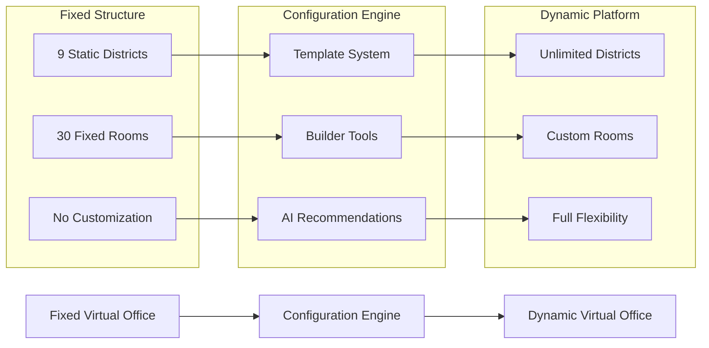

# Dynamic Districts and Rooms Configuration Concept
## Transforming the Virtual Office from Fixed to Flexible

---

## Executive Summary

The Dynamic Districts and Rooms Configuration system represents a fundamental paradigm shift in virtual office architecture, transforming the Agentic Intelligence Virtual Office from a rigid, predefined structure to a fully customizable, user-driven platform. This concept document outlines the vision, principles, and transformative impact of enabling users to create, modify, and manage their own virtual office spaces.

---

## The Configuration Revolution

### From Fixed to Flexible

#### Current State: Fixed Architecture
- **9 Predefined Districts**: Rigid organizational structure
- **30+ Static Rooms**: Unchangeable layouts and functions
- **One-Size-Fits-All**: Same structure for every organization
- **Limited Adaptation**: No customization for specific needs
- **Documentation-Based**: Changes require development cycles

#### Future State: Dynamic Configuration
- **Unlimited Districts**: Create districts tailored to specific needs
- **Infinite Room Possibilities**: Design rooms for exact requirements
- **Template-Driven**: Start with proven configurations, then customize
- **Real-Time Creation**: Instant deployment of new spaces
- **User-Controlled**: Business users manage their own virtual office

### The Transformation Vision



---

## Core Concept Principles

### 1. Template-Driven Creation
**Philosophy**: "Start with proven success, then make it your own"

- **Default Templates**: Proven district and room configurations
- **Industry-Specific**: Templates for healthcare, finance, manufacturing, etc.
- **Role-Based**: Templates optimized for different organizational functions
- **Community Sharing**: Users share successful configurations
- **AI-Curated**: Machine learning identifies and promotes effective patterns

### 2. Progressive Customization
**Philosophy**: "Evolve your virtual office as your needs evolve"

- **Start Simple**: Begin with template, gradually customize
- **Iterative Improvement**: Continuous refinement based on usage
- **A/B Testing**: Test different configurations to find optimal layouts
- **Performance Feedback**: System suggests improvements based on metrics
- **Change Management**: Track and manage configuration evolution

### 3. Context-Aware Intelligence
**Philosophy**: "Your virtual office should understand and adapt to your work"

- **Usage Patterns**: Learn from how spaces are actually used
- **Workflow Optimization**: Suggest layouts that improve productivity
- **Collaboration Enhancement**: Design spaces that foster teamwork
- **Efficiency Metrics**: Measure and optimize space effectiveness
- **Predictive Adaptation**: Anticipate needs before they arise

### 4. Democratized Architecture
**Philosophy**: "Anyone should be able to design effective virtual spaces"

- **No-Code Tools**: Visual, intuitive configuration interfaces
- **Guided Wizards**: Step-by-step assistance for complex setups
- **Best Practice Integration**: Built-in guidance from successful patterns
- **Validation Systems**: Prevent configurations that would reduce effectiveness
- **Expert Support**: Access to virtual office design expertise

---

## District Configuration Framework

### District Types and Purposes

#### Functional Districts
**Purpose**: Organize around business functions
```
Marketing District
├── Brand Management Room
├── Campaign Command Center
├── Social Media Monitoring Room
├── Customer Analytics Lab
└── Content Creation Studio
```

#### Project-Based Districts
**Purpose**: Temporary spaces for specific initiatives
```
Product Launch District
├── Project Command Room
├── Development Workspace
├── Testing Laboratory
├── Marketing War Room
└── Launch Coordination Center
```

#### Community Districts
**Purpose**: Foster collaboration and culture
```
Innovation Community
├── Idea Generation Space
├── Prototype Workshop
├── Innovation Showcase
├── Collaboration Lounge
└── Mentorship Center
```

#### Process Districts
**Purpose**: Optimize specific business processes
```
Customer Onboarding District
├── Welcome Center
├── Documentation Processing
├── Training Room
├── Support Hub
└── Success Metrics Center
```

### District Capabilities Matrix

| Capability | Business | Innovation | Operations | Support | Community |
|------------|----------|------------|------------|---------|-----------|
| Process Automation | ✅ High | ⚡ Medium | ✅ High | ⚡ Medium | ❌ Low |
| Creative Tools | ⚡ Medium | ✅ High | ❌ Low | ⚡ Medium | ✅ High |
| Analytics | ✅ High | ✅ High | ✅ High | ✅ High | ⚡ Medium |
| Collaboration | ✅ High | ✅ High | ⚡ Medium | ✅ High | ✅ High |
| Integration | ✅ High | ⚡ Medium | ✅ High | ✅ High | ❌ Low |

---

## Room Configuration Framework

### Room Archetypes

#### Command Centers
**Purpose**: Mission-critical monitoring and control
- **Features**: Multi-screen displays, real-time dashboards, alert systems
- **Agents**: Monitoring specialists, alert managers, coordination agents
- **Use Cases**: Operations monitoring, security oversight, crisis management

#### Collaboration Spaces
**Purpose**: Team-based work and creative sessions
- **Features**: Virtual whiteboards, breakout areas, presentation tools
- **Agents**: Facilitation agents, content curators, meeting coordinators
- **Use Cases**: Brainstorming, project planning, team meetings

#### Analytics Laboratories
**Purpose**: Data analysis and insight generation
- **Features**: Data visualization tools, statistical analysis, modeling capabilities
- **Agents**: Data scientists, analytics specialists, visualization experts
- **Use Cases**: Business intelligence, predictive modeling, research

#### Workshop Studios
**Purpose**: Creative development and prototyping
- **Features**: Design tools, simulation environments, rapid prototyping
- **Agents**: Creative assistants, technical advisors, project managers
- **Use Cases**: Product development, process design, innovation projects

#### Learning Centers
**Purpose**: Training and skill development
- **Features**: Interactive tutorials, assessment tools, knowledge repositories
- **Agents**: Training specialists, subject matter experts, progress trackers
- **Use Cases**: Onboarding, skill development, certification programs

### Room Feature Matrix

| Feature Category | Command | Collaboration | Analytics | Workshop | Learning |
|------------------|---------|---------------|-----------|----------|----------|
| **Monitoring** | ✅ Primary | ❌ None | ⚡ Secondary | ❌ None | ❌ None |
| **Visualization** | ✅ Primary | ⚡ Secondary | ✅ Primary | ✅ Primary | ⚡ Secondary |
| **Communication** | ✅ Primary | ✅ Primary | ⚡ Secondary | ✅ Primary | ✅ Primary |
| **Creation Tools** | ❌ None | ⚡ Secondary | ⚡ Secondary | ✅ Primary | ⚡ Secondary |
| **Learning Systems** | ❌ None | ❌ None | ⚡ Secondary | ⚡ Secondary | ✅ Primary |

---

## User Experience Journey

### The Configuration Journey

#### 1. Discovery Phase
**Goal**: Understand needs and explore possibilities
- **Template Exploration**: Browse available district and room templates
- **Needs Assessment**: AI-guided questionnaire to identify requirements
- **Best Practice Review**: Learn from successful configurations
- **Inspiration Gallery**: See innovative uses of virtual spaces

#### 2. Design Phase
**Goal**: Create the initial configuration
- **Template Selection**: Choose starting point based on needs
- **Customization Workshop**: Guided modification of template
- **Feature Selection**: Choose capabilities and integrations
- **Preview Mode**: Visualize the configured space before creation

#### 3. Creation Phase
**Goal**: Deploy the configured virtual office
- **Automated Setup**: System creates districts and rooms
- **Agent Deployment**: AI agents are assigned to appropriate spaces
- **Integration Configuration**: Connect to existing business systems
- **Access Setup**: Configure permissions and user access

#### 4. Evolution Phase
**Goal**: Continuously improve and adapt
- **Usage Analytics**: Monitor how spaces are actually used
- **Performance Metrics**: Track effectiveness and efficiency
- **Optimization Suggestions**: AI recommends improvements
- **Iterative Refinement**: Gradually evolve the configuration

### User Personas and Configuration Needs

#### The Executive Strategist
**Needs**: High-level oversight and strategic coordination
```
Executive Command District
├── Strategic Dashboard Room
├── Board Presentation Theater
├── Crisis Management Center
├── KPI Observatory
└── Stakeholder Communication Hub
```

#### The Innovation Manager
**Needs**: Creative environments and experimentation spaces
```
Innovation Playground District
├── Ideation Studio
├── Prototype Laboratory
├── Trend Analysis Center
├── Innovation Showcase
└── Collaboration Workshop
```

#### The Operations Director
**Needs**: Process optimization and operational control
```
Operations Excellence District
├── Process Control Center
├── Quality Assurance Lab
├── Performance Analytics Room
├── Resource Optimization Hub
└── Efficiency Command Center
```

#### The Team Leader
**Needs**: Team coordination and productivity tools
```
Team Productivity District
├── Daily Standup Room
├── Project War Room
├── Team Analytics Center
├── Skill Development Lab
└── Recognition Lounge
```

#### The Individual Contributor
**Needs**: Personal productivity and skill development
```
Personal Workspace District
├── Focus Work Room
├── Learning Center
├── Collaboration Hub
├── Personal Analytics
└── Innovation Sandbox
```

---

## Configuration Templates Library

### Industry-Specific Templates

#### Healthcare Organization
```
Clinical Excellence District
├── Patient Care Coordination Center
├── Medical Research Laboratory
├── Compliance Monitoring Room
├── Staff Training Center
└── Quality Improvement Hub

Administrative District
├── Financial Operations Center
├── HR Management Suite
├── Supply Chain Command
├── Regulatory Affairs Office
└── Executive Briefing Room
```

#### Financial Services
```
Risk Management District
├── Market Monitoring Center
├── Credit Analysis Laboratory
├── Compliance Control Room
├── Risk Analytics Hub
└── Crisis Response Center

Customer Experience District
├── Customer Journey Analytics
├── Service Quality Center
├── Digital Banking Hub
├── Wealth Management Suite
└── Customer Success Center
```

#### Manufacturing Enterprise
```
Production Excellence District
├── Shop Floor Command Center
├── Quality Control Laboratory
├── Supply Chain Coordination
├── Maintenance Management
└── Safety Monitoring Center

Innovation District
├── Product Development Studio
├── Engineering Laboratory
├── Test & Validation Center
├── Design Collaboration Space
└── Patent & IP Management
```

#### Technology Company
```
Development District
├── Engineering Command Center
├── DevOps Control Room
├── Product Analytics Lab
├── User Research Studio
└── Innovation Workshop

Customer Success District
├── Support Operations Center
├── Customer Health Analytics
├── Product Adoption Studio
├── Success Metrics Observatory
└── Community Management Hub
```

### Functional Templates

#### Marketing Department
```
Marketing Command District
├── Campaign Management Center
├── Brand Analytics Laboratory
├── Social Media War Room
├── Content Creation Studio
├── Customer Insights Hub
└── Performance Metrics Center
```

#### Sales Organization
```
Sales Performance District
├── Sales Command Center
├── Pipeline Analytics Lab
├── Customer Relationship Hub
├── Territory Management Room
├── Training & Enablement Center
└── Competitive Intelligence Room
```

#### Human Resources
```
People Excellence District
├── Talent Acquisition Center
├── Employee Experience Hub
├── Performance Management Studio
├── Learning & Development Lab
├── Culture & Engagement Space
└── Compliance Monitoring Center
```

---

## AI-Powered Intelligence

### Smart Configuration Recommendations

#### Pattern Recognition
- **Successful Configurations**: Identify patterns in high-performing setups
- **Industry Best Practices**: Learn from successful implementations across industries
- **Role-Based Optimization**: Understand what works for different user types
- **Workflow Analysis**: Optimize layouts based on actual work patterns

#### Predictive Optimization
- **Usage Forecasting**: Predict how spaces will be used before creation
- **Capacity Planning**: Ensure optimal sizing and resource allocation
- **Integration Suggestions**: Recommend beneficial system connections
- **Evolution Pathways**: Suggest natural progression paths for configurations

#### Continuous Learning
- **Performance Monitoring**: Track effectiveness of different configurations
- **User Behavior Analysis**: Learn from how users interact with spaces
- **Feedback Integration**: Incorporate user satisfaction and productivity metrics
- **Adaptive Improvement**: Automatically suggest optimizations based on usage

### Configuration Intelligence Features

#### Smart Template Matching
```python
# AI analyzes organization and recommends optimal templates
organization_profile = {
    "industry": "financial_services",
    "size": "enterprise",
    "culture": "innovation_focused",
    "regulatory_environment": "high"
}

recommended_templates = ai_engine.recommend_templates(organization_profile)
# Returns: [Risk Management District, Innovation Lab, Compliance Center]
```

#### Dynamic Optimization
```python
# System continuously optimizes configuration based on usage
usage_data = monitor_space_utilization(district_id)
optimization_suggestions = ai_engine.analyze_optimization_opportunities(usage_data)
# Returns: [Room consolidation, Feature additions, Workflow improvements]
```

#### Predictive Configuration
```python
# AI predicts optimal configuration before deployment
team_profile = analyze_team_characteristics(team_id)
predicted_optimal_config = ai_engine.predict_optimal_configuration(team_profile)
# Returns: Recommended district layout with confidence scores
```

---

## Implementation Roadmap

### Phase 1: Foundation (Months 1-3)
**Goal**: Establish core configuration capabilities

#### Infrastructure Development
- **Database Schema**: Extended schema supporting dynamic configurations
- **Configuration Engine**: Core services for creating and managing configurations
- **Template System**: Framework for template creation and management
- **Basic UI Components**: Essential configuration interfaces

#### Initial Template Library
- **Default Districts**: Convert existing 9 districts to templates
- **Basic Rooms**: Essential room types with customization options
- **Industry Starters**: 5 industry-specific template sets
- **Role-Based Templates**: Templates for common organizational roles

### Phase 2: User Experience (Months 4-6)
**Goal**: Create intuitive configuration experiences

#### Advanced UI Development
- **Configuration Wizards**: Step-by-step guided configuration
- **Visual Builders**: Drag-and-drop interface for space design
- **Preview Systems**: Real-time visualization of configurations
- **Template Browser**: Sophisticated template discovery and selection

#### Smart Features
- **Basic AI Recommendations**: Simple template matching
- **Usage Analytics**: Track configuration effectiveness
- **Validation Systems**: Prevent problematic configurations
- **Best Practice Integration**: Built-in guidance and suggestions

### Phase 3: Intelligence (Months 7-9)
**Goal**: Add AI-powered optimization and automation

#### AI Enhancement
- **Advanced Recommendations**: Machine learning-powered suggestions
- **Predictive Optimization**: Forecast optimal configurations
- **Continuous Learning**: System learns from usage patterns
- **Automated Optimization**: Self-improving configurations

#### Community Features
- **Template Marketplace**: User-created template sharing
- **Rating System**: Community validation of templates
- **Best Practice Sharing**: Knowledge sharing platform
- **Expert Network**: Access to configuration expertise

### Phase 4: Enterprise Scale (Months 10-12)
**Goal**: Support enterprise deployment and governance

#### Enterprise Features
- **Governance Framework**: Administrative controls and policies
- **Compliance Integration**: Regulatory compliance enforcement
- **Multi-Tenant Support**: Organization isolation and management
- **Advanced Security**: Enterprise-grade security controls

#### Integration Ecosystem
- **API Framework**: Third-party integration capabilities
- **Marketplace Integration**: External template and tool ecosystem
- **Migration Tools**: Enterprise data migration capabilities
- **Performance Optimization**: Enterprise-scale performance tuning

---

## Success Metrics and KPIs

### User Adoption Metrics

#### Configuration Activity
- **Configuration Completion Rate**: 85%+ of started configurations completed
- **Template Usage Rate**: 70%+ of configurations start with templates
- **Customization Depth**: Average number of modifications per template
- **Time to Configuration**: Average time from start to deployed configuration

#### User Satisfaction
- **Configuration Experience Rating**: 4.5+ stars average rating
- **Ease of Use Score**: Net Promoter Score for configuration tools
- **Help-Seeking Frequency**: Reduction in support requests
- **User Confidence**: Self-reported confidence in configuration abilities

### Business Impact Metrics

#### Productivity Improvements
- **Time to Value**: 80% reduction in time to create new virtual spaces
- **Space Utilization**: Improvement in virtual space usage efficiency
- **Collaboration Effectiveness**: Increased cross-team collaboration metrics
- **Process Efficiency**: Workflow completion time improvements

#### Platform Metrics
- **Active Configurations**: Number of user-created configurations in use
- **Template Adoption**: Most popular and effective templates
- **Community Contribution**: User-generated templates and modifications
- **System Performance**: Configuration system response times and reliability

### Innovation Metrics

#### Creative Configuration
- **Unique Configurations**: Percentage of completely custom configurations
- **Innovation Index**: Measure of novel configuration approaches
- **Best Practice Evolution**: Rate of new best practices emergence
- **Cross-Industry Learning**: Knowledge transfer between industries

#### Ecosystem Growth
- **Template Ecosystem Size**: Number of available templates
- **Community Engagement**: Active users in template community
- **Expert Network Growth**: Certified configuration experts
- **Integration Expansion**: Third-party tools and integrations available

---

## Risk Management and Mitigation

### Configuration Risks

#### User Experience Risks
**Risk**: Users create ineffective configurations
**Mitigation**: 
- Built-in validation and best practice guidance
- AI-powered optimization suggestions
- Template starting points with proven effectiveness
- Easy rollback to previous configurations

**Risk**: Configuration complexity overwhelms users
**Mitigation**:
- Progressive disclosure of advanced features
- Guided wizards for complex configurations
- Expert support and consultation services
- Pre-configured templates for quick deployment

#### Technical Risks
**Risk**: System performance degradation with complex configurations
**Mitigation**:
- Performance monitoring and optimization
- Resource allocation limits and guidance
- Automated scaling and load balancing
- Configuration complexity scoring and warnings

**Risk**: Integration failures with custom configurations
**Mitigation**:
- Robust integration testing framework
- Sandbox environments for testing configurations
- Rollback capabilities for failed integrations
- Expert review for complex integration scenarios

#### Business Risks
**Risk**: Loss of organizational standardization
**Mitigation**:
- Governance frameworks with organizational policies
- Template approval processes for public sharing
- Administrative controls over configuration permissions
- Audit trails and compliance monitoring

**Risk**: Reduced adoption due to change management challenges
**Mitigation**:
- Gradual migration path from fixed to dynamic
- Training and support programs
- Change management consulting services
- Success story sharing and community building

---

## Future Vision and Innovation

### Next-Generation Capabilities

#### Immersive Configuration
- **VR/AR Design Tools**: Design virtual spaces in virtual reality
- **3D Spatial Modeling**: Full three-dimensional space design
- **Haptic Feedback**: Physical sensation in virtual space design
- **Collaborative Design**: Multi-user simultaneous configuration

#### Adaptive Intelligence
- **Predictive Configuration**: AI predicts and pre-configures optimal spaces
- **Autonomous Optimization**: Self-healing and self-improving configurations
- **Context-Aware Adaptation**: Spaces that adapt to current activities
- **Emotional Intelligence**: Configurations that respond to user emotional states

#### Global Collaboration
- **Cross-Organization Templates**: Shared templates across enterprise boundaries
- **Industry Consortiums**: Collaborative development of industry standards
- **Global Best Practices**: Worldwide sharing of effective configurations
- **Cultural Adaptation**: Configurations adapted for different cultural contexts

### Innovation Opportunities

#### New Configuration Paradigms
- **Process-Driven Configuration**: Configurations that automatically adapt to business processes
- **Event-Responsive Spaces**: Rooms that reconfigure based on calendar events
- **Mood-Responsive Environments**: Spaces that adapt to team emotional states
- **Learning Configurations**: Spaces that evolve based on learning objectives

#### Integration Innovations
- **IoT Integration**: Physical sensors informing virtual space configuration
- **Biometric Optimization**: Configurations optimized for human physiology
- **Environmental Adaptation**: Virtual spaces that reflect physical environment
- **Augmented Reality Overlay**: Physical space enhancement through AR

---

## Conclusion

The Dynamic Districts and Rooms Configuration system represents more than a technical enhancement—it embodies a fundamental reimagining of how organizations can structure and optimize their virtual work environments. By transforming from a fixed architecture to a flexible, user-driven platform, we enable unprecedented customization while maintaining the sophisticated functionality that makes virtual offices effective.

### Key Transformational Outcomes

1. **Democratized Design**: Any user can create effective virtual office configurations
2. **Organizational Alignment**: Virtual offices that perfectly match organizational structure and culture
3. **Continuous Evolution**: Spaces that grow and adapt with changing business needs
4. **Community Innovation**: Shared knowledge and best practices across the user community
5. **AI-Powered Optimization**: Intelligent systems that continuously improve configurations

### Strategic Competitive Advantage

This configuration system provides unique market positioning by:
- **Eliminating Lock-In**: Organizations aren't constrained by vendor-defined structures
- **Accelerating Adoption**: Quick deployment through template-driven approaches
- **Reducing Risk**: Proven configurations reduce implementation uncertainty
- **Enabling Innovation**: Platform for organizational innovation and experimentation
- **Creating Network Effects**: Value increases as more users contribute to template ecosystem

### Vision for the Future

The dynamic configuration system establishes the foundation for a truly adaptive virtual office platform that will continue to evolve with advances in AI, VR/AR, and collaborative technologies. It represents not just a feature, but a new paradigm for how organizations can leverage technology to create optimal work environments that enhance human potential and organizational effectiveness.

This concept transforms the Agentic Intelligence Virtual Office from a sophisticated tool into an adaptive partner in organizational success, capable of evolving and optimizing alongside the organizations it serves.
