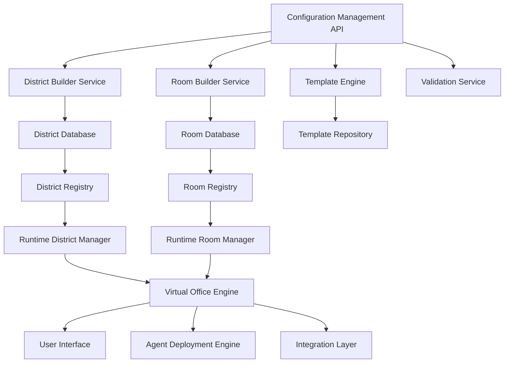

# Dynamic Districts and Rooms Configuration System
## Making the Virtual Office Fully Configurable

---

## Overview

This document outlines the implementation of a dynamic configuration system that allows users to create, modify, and manage districts and rooms within the Agentic Intelligence Virtual Office, replacing the current fixed structure with a flexible, user-driven approach.

## Current State Analysis

### Current Fixed Structure
- **9 Predefined Districts**: From Command District to Field Operations Station
- **30+ Predefined Rooms**: Each with specific functions and limitations
- **Static Documentation**: Districts and rooms are defined in markdown files
- **Limited Flexibility**: No ability for users to customize or create new spaces

### Problems with Current Approach
1. **Rigid Structure**: Organizations must adapt to predefined layouts
2. **No Customization**: Users cannot create domain-specific districts
3. **Scalability Issues**: Adding new districts requires code changes
4. **One-Size-Fits-All**: Doesn't accommodate different organizational needs

---

## Dynamic Configuration Architecture

### Core Components



### Database Schema Extensions

Building on the existing schema, we add configuration management tables:

```sql
-- District Configuration Templates
CREATE TABLE district_template (
    template_id VARCHAR(50) PRIMARY KEY,
    template_name VARCHAR(255) NOT NULL,
    template_description TEXT,
    template_category ENUM('business', 'technical', 'creative', 'operations', 'support', 'custom'),
    template_config JSON,
    default_rooms JSON,
    suggested_agents JSON,
    required_capabilities JSON,
    optional_capabilities JSON,
    created_by VARCHAR(50),
    created_at TIMESTAMP DEFAULT CURRENT_TIMESTAMP,
    updated_at TIMESTAMP DEFAULT CURRENT_TIMESTAMP ON UPDATE CURRENT_TIMESTAMP,
    is_system_template BOOLEAN DEFAULT FALSE,
    is_public BOOLEAN DEFAULT TRUE,
    usage_count INT DEFAULT 0,
    FOREIGN KEY (created_by) REFERENCES user(user_id),
    INDEX idx_template_category (template_category),
    INDEX idx_template_usage (usage_count DESC)
);

-- Room Configuration Templates
CREATE TABLE room_template (
    template_id VARCHAR(50) PRIMARY KEY,
    template_name VARCHAR(255) NOT NULL,
    template_description TEXT,
    template_category ENUM('meeting', 'workspace', 'laboratory', 'control-center', 'collaboration', 'custom'),
    template_config JSON,
    default_agents JSON,
    required_integrations JSON,
    suggested_features JSON,
    capacity_range JSON,
    created_by VARCHAR(50),
    created_at TIMESTAMP DEFAULT CURRENT_TIMESTAMP,
    updated_at TIMESTAMP DEFAULT CURRENT_TIMESTAMP ON UPDATE CURRENT_TIMESTAMP,
    is_system_template BOOLEAN DEFAULT FALSE,
    is_public BOOLEAN DEFAULT TRUE,
    usage_count INT DEFAULT 0,
    FOREIGN KEY (created_by) REFERENCES user(user_id),
    INDEX idx_room_template_category (template_category),
    INDEX idx_room_template_usage (usage_count DESC)
);

-- User-Created Districts (extends existing district table)
CREATE TABLE user_district (
    user_district_id VARCHAR(50) PRIMARY KEY,
    district_id VARCHAR(50) NOT NULL,
    user_id VARCHAR(50) NOT NULL,
    workspace_id VARCHAR(50) NOT NULL,
    template_id VARCHAR(50),
    district_name VARCHAR(255) NOT NULL,
    district_description TEXT,
    district_type ENUM('functional', 'project-based', 'community', 'process', 'temporary', 'experimental'),
    business_function VARCHAR(100),
    custom_config JSON,
    permissions JSON,
    sharing_settings JSON,
    created_at TIMESTAMP DEFAULT CURRENT_TIMESTAMP,
    updated_at TIMESTAMP DEFAULT CURRENT_TIMESTAMP ON UPDATE CURRENT_TIMESTAMP,
    FOREIGN KEY (district_id) REFERENCES district(district_id),
    FOREIGN KEY (user_id) REFERENCES user(user_id),
    FOREIGN KEY (workspace_id) REFERENCES workspace(workspace_id),
    FOREIGN KEY (template_id) REFERENCES district_template(template_id),
    INDEX idx_user_district (user_id, workspace_id),
    INDEX idx_district_template (template_id)
);

-- User-Created Rooms (extends existing room table)
CREATE TABLE user_room (
    user_room_id VARCHAR(50) PRIMARY KEY,
    room_id VARCHAR(50) NOT NULL,
    user_id VARCHAR(50) NOT NULL,
    district_id VARCHAR(50) NOT NULL,
    template_id VARCHAR(50),
    room_name VARCHAR(255) NOT NULL,
    room_description TEXT,
    room_type ENUM('meeting', 'workspace', 'laboratory', 'control-center', 'collaboration', 'custom'),
    custom_config JSON,
    permissions JSON,
    sharing_settings JSON,
    created_at TIMESTAMP DEFAULT CURRENT_TIMESTAMP,
    updated_at TIMESTAMP DEFAULT CURRENT_TIMESTAMP ON UPDATE CURRENT_TIMESTAMP,
    FOREIGN KEY (room_id) REFERENCES room(room_id),
    FOREIGN KEY (user_id) REFERENCES user(user_id),
    FOREIGN KEY (district_id) REFERENCES district(district_id),
    FOREIGN KEY (template_id) REFERENCES room_template(template_id),
    INDEX idx_user_room (user_id, district_id),
    INDEX idx_room_template (template_id)
);

-- Configuration Change History
CREATE TABLE configuration_history (
    history_id VARCHAR(50) PRIMARY KEY,
    entity_type ENUM('district', 'room', 'template'),
    entity_id VARCHAR(50) NOT NULL,
    change_type ENUM('create', 'update', 'delete', 'template_change'),
    changed_by VARCHAR(50),
    change_description TEXT,
    before_config JSON,
    after_config JSON,
    change_timestamp TIMESTAMP DEFAULT CURRENT_TIMESTAMP,
    FOREIGN KEY (changed_by) REFERENCES user(user_id),
    INDEX idx_entity_history (entity_type, entity_id, change_timestamp),
    INDEX idx_user_changes (changed_by, change_timestamp)
);
```

---

## Implementation Components

### 1. District Builder Service

```python
# districts/builder.py
from typing import Dict, List, Optional
from pydantic import BaseModel
from sqlalchemy.orm import Session

class DistrictConfig(BaseModel):
    name: str
    description: str
    district_type: str
    business_function: str
    capabilities: Dict
    spatial_layout: Dict
    rooms: List[str] = []
    agents: List[str] = []
    integrations: List[str] = []

class DistrictBuilder:
    def __init__(self, db: Session):
        self.db = db
    
    async def create_district_from_template(
        self, 
        template_id: str, 
        user_id: str, 
        workspace_id: str,
        customizations: Dict = None
    ) -> str:
        """Create a new district from a template"""
        template = await self.get_template(template_id)
        
        # Merge template config with customizations
        config = self._merge_config(template.config, customizations)
        
        # Validate configuration
        await self._validate_district_config(config, workspace_id)
        
        # Create district
        district = await self._create_district(config, user_id, workspace_id)
        
        # Create default rooms if specified
        if template.default_rooms:
            await self._create_default_rooms(district.district_id, template.default_rooms)
        
        # Deploy suggested agents
        if template.suggested_agents:
            await self._deploy_suggested_agents(district.district_id, template.suggested_agents)
        
        return district.district_id
    
    async def create_custom_district(
        self,
        config: DistrictConfig,
        user_id: str,
        workspace_id: str
    ) -> str:
        """Create a completely custom district"""
        # Validate configuration
        await self._validate_district_config(config.dict(), workspace_id)
        
        # Create district
        district = await self._create_district(config.dict(), user_id, workspace_id)
        
        # Log creation
        await self._log_configuration_change(
            'district', district.district_id, 'create', user_id, config.dict()
        )
        
        return district.district_id
    
    async def update_district(
        self,
        district_id: str,
        updates: Dict,
        user_id: str
    ) -> bool:
        """Update an existing district"""
        # Check permissions
        if not await self._check_district_permissions(district_id, user_id, 'update'):
            raise PermissionError("User doesn't have permission to update this district")
        
        # Get current config
        current_config = await self._get_district_config(district_id)
        
        # Validate updates
        new_config = {**current_config, **updates}
        await self._validate_district_config(new_config, None)
        
        # Apply updates
        await self._update_district_config(district_id, new_config)
        
        # Log change
        await self._log_configuration_change(
            'district', district_id, 'update', user_id, current_config, new_config
        )
        
        return True
    
    async def delete_district(self, district_id: str, user_id: str) -> bool:
        """Delete a district and all its rooms"""
        # Check permissions
        if not await self._check_district_permissions(district_id, user_id, 'delete'):
            raise PermissionError("User doesn't have permission to delete this district")
        
        # Get current config for logging
        current_config = await self._get_district_config(district_id)
        
        # Delete associated rooms
        await self._delete_district_rooms(district_id)
        
        # Delete district
        await self._delete_district(district_id)
        
        # Log deletion
        await self._log_configuration_change(
            'district', district_id, 'delete', user_id, current_config
        )
        
        return True
    
    async def get_user_districts(self, user_id: str, workspace_id: str) -> List[Dict]:
        """Get all districts accessible to a user"""
        return await self._query_user_districts(user_id, workspace_id)
    
    async def get_district_templates(self, category: str = None) -> List[Dict]:
        """Get available district templates"""
        return await self._query_district_templates(category)
```

### 2. Room Builder Service

```python
# rooms/builder.py
class RoomConfig(BaseModel):
    name: str
    description: str
    room_type: str
    capacity: int
    features: Dict
    agents: List[str] = []
    integrations: List[str] = []

class RoomBuilder:
    def __init__(self, db: Session):
        self.db = db
    
    async def create_room_from_template(
        self,
        template_id: str,
        district_id: str,
        user_id: str,
        customizations: Dict = None
    ) -> str:
        """Create a new room from a template"""
        template = await self.get_room_template(template_id)
        
        # Check district permissions
        if not await self._check_district_permissions(district_id, user_id, 'create_room'):
            raise PermissionError("User doesn't have permission to create rooms in this district")
        
        # Merge template config with customizations
        config = self._merge_config(template.config, customizations)
        
        # Validate configuration
        await self._validate_room_config(config, district_id)
        
        # Create room
        room = await self._create_room(config, district_id, user_id)
        
        # Deploy default agents if specified
        if template.default_agents:
            await self._deploy_default_agents(room.room_id, template.default_agents)
        
        return room.room_id
    
    async def create_custom_room(
        self,
        config: RoomConfig,
        district_id: str,
        user_id: str
    ) -> str:
        """Create a completely custom room"""
        # Check permissions
        if not await self._check_district_permissions(district_id, user_id, 'create_room'):
            raise PermissionError("User doesn't have permission to create rooms in this district")
        
        # Validate configuration
        await self._validate_room_config(config.dict(), district_id)
        
        # Create room
        room = await self._create_room(config.dict(), district_id, user_id)
        
        # Log creation
        await self._log_configuration_change(
            'room', room.room_id, 'create', user_id, config.dict()
        )
        
        return room.room_id
    
    async def clone_room(
        self,
        source_room_id: str,
        target_district_id: str,
        user_id: str,
        new_name: str = None
    ) -> str:
        """Clone an existing room to another district"""
        # Check source permissions
        if not await self._check_room_permissions(source_room_id, user_id, 'read'):
            raise PermissionError("User doesn't have permission to access source room")
        
        # Check target permissions
        if not await self._check_district_permissions(target_district_id, user_id, 'create_room'):
            raise PermissionError("User doesn't have permission to create rooms in target district")
        
        # Get source room config
        source_config = await self._get_room_config(source_room_id)
        
        # Modify for cloning
        if new_name:
            source_config['name'] = new_name
        else:
            source_config['name'] = f"{source_config['name']} (Copy)"
        
        # Create cloned room
        return await self.create_custom_room(
            RoomConfig(**source_config), target_district_id, user_id
        )
```

### 3. Template Management System

```python
# templates/manager.py
class TemplateManager:
    def __init__(self, db: Session):
        self.db = db
    
    async def create_district_template(
        self,
        template_config: Dict,
        user_id: str,
        is_public: bool = False
    ) -> str:
        """Create a new district template"""
        # Validate template configuration
        await self._validate_template_config(template_config, 'district')
        
        # Create template
        template = await self._create_district_template(
            template_config, user_id, is_public
        )
        
        return template.template_id
    
    async def create_room_template(
        self,
        template_config: Dict,
        user_id: str,
        is_public: bool = False
    ) -> str:
        """Create a new room template"""
        # Validate template configuration
        await self._validate_template_config(template_config, 'room')
        
        # Create template
        template = await self._create_room_template(
            template_config, user_id, is_public
        )
        
        return template.template_id
    
    async def get_recommended_templates(
        self,
        user_id: str,
        context: Dict
    ) -> List[Dict]:
        """Get AI-recommended templates based on user context"""
        # Analyze user's existing districts/rooms
        user_patterns = await self._analyze_user_patterns(user_id)
        
        # Get organizational context
        org_context = await self._get_organizational_context(user_id)
        
        # Use AI to recommend templates
        recommendations = await self._ai_recommend_templates(
            user_patterns, org_context, context
        )
        
        return recommendations
    
    async def save_as_template(
        self,
        entity_type: str,
        entity_id: str,
        template_name: str,
        user_id: str,
        is_public: bool = False
    ) -> str:
        """Save an existing district or room as a template"""
        # Get entity configuration
        if entity_type == 'district':
            config = await self._get_district_config(entity_id)
        else:
            config = await self._get_room_config(entity_id)
        
        # Clean config for template use
        template_config = self._clean_config_for_template(config)
        
        # Create template
        if entity_type == 'district':
            return await self.create_district_template(
                {
                    'name': template_name,
                    'config': template_config,
                    'category': 'custom'
                },
                user_id,
                is_public
            )
        else:
            return await self.create_room_template(
                {
                    'name': template_name,
                    'config': template_config,
                    'category': 'custom'
                },
                user_id,
                is_public
            )
```

### 4. Configuration API

```python
# api/configuration.py
from fastapi import APIRouter, Depends, HTTPException
from sqlalchemy.orm import Session

router = APIRouter(prefix="/api/v1/configuration", tags=["configuration"])

@router.post("/districts/from-template")
async def create_district_from_template(
    template_id: str,
    workspace_id: str,
    customizations: Dict = None,
    current_user: User = Depends(get_current_user),
    db: Session = Depends(get_db)
):
    """Create a new district from a template"""
    builder = DistrictBuilder(db)
    
    try:
        district_id = await builder.create_district_from_template(
            template_id, current_user.user_id, workspace_id, customizations
        )
        return {"district_id": district_id, "status": "created"}
    except Exception as e:
        raise HTTPException(status_code=400, detail=str(e))

@router.post("/districts/custom")
async def create_custom_district(
    config: DistrictConfig,
    workspace_id: str,
    current_user: User = Depends(get_current_user),
    db: Session = Depends(get_db)
):
    """Create a completely custom district"""
    builder = DistrictBuilder(db)
    
    try:
        district_id = await builder.create_custom_district(
            config, current_user.user_id, workspace_id
        )
        return {"district_id": district_id, "status": "created"}
    except Exception as e:
        raise HTTPException(status_code=400, detail=str(e))

@router.put("/districts/{district_id}")
async def update_district(
    district_id: str,
    updates: Dict,
    current_user: User = Depends(get_current_user),
    db: Session = Depends(get_db)
):
    """Update an existing district"""
    builder = DistrictBuilder(db)
    
    try:
        success = await builder.update_district(
            district_id, updates, current_user.user_id
        )
        return {"status": "updated" if success else "failed"}
    except Exception as e:
        raise HTTPException(status_code=400, detail=str(e))

@router.delete("/districts/{district_id}")
async def delete_district(
    district_id: str,
    current_user: User = Depends(get_current_user),
    db: Session = Depends(get_db)
):
    """Delete a district"""
    builder = DistrictBuilder(db)
    
    try:
        success = await builder.delete_district(district_id, current_user.user_id)
        return {"status": "deleted" if success else "failed"}
    except Exception as e:
        raise HTTPException(status_code=400, detail=str(e))

@router.get("/districts/templates")
async def get_district_templates(
    category: Optional[str] = None,
    db: Session = Depends(get_db)
):
    """Get available district templates"""
    builder = DistrictBuilder(db)
    templates = await builder.get_district_templates(category)
    return {"templates": templates}

@router.post("/rooms/from-template")
async def create_room_from_template(
    template_id: str,
    district_id: str,
    customizations: Dict = None,
    current_user: User = Depends(get_current_user),
    db: Session = Depends(get_db)
):
    """Create a new room from a template"""
    builder = RoomBuilder(db)
    
    try:
        room_id = await builder.create_room_from_template(
            template_id, district_id, current_user.user_id, customizations
        )
        return {"room_id": room_id, "status": "created"}
    except Exception as e:
        raise HTTPException(status_code=400, detail=str(e))

@router.post("/rooms/custom")
async def create_custom_room(
    config: RoomConfig,
    district_id: str,
    current_user: User = Depends(get_current_user),
    db: Session = Depends(get_db)
):
    """Create a completely custom room"""
    builder = RoomBuilder(db)
    
    try:
        room_id = await builder.create_custom_room(
            config, district_id, current_user.user_id
        )
        return {"room_id": room_id, "status": "created"}
    except Exception as e:
        raise HTTPException(status_code=400, detail=str(e))

@router.post("/rooms/{room_id}/clone")
async def clone_room(
    room_id: str,
    target_district_id: str,
    new_name: Optional[str] = None,
    current_user: User = Depends(get_current_user),
    db: Session = Depends(get_db)
):
    """Clone an existing room"""
    builder = RoomBuilder(db)
    
    try:
        new_room_id = await builder.clone_room(
            room_id, target_district_id, current_user.user_id, new_name
        )
        return {"room_id": new_room_id, "status": "cloned"}
    except Exception as e:
        raise HTTPException(status_code=400, detail=str(e))

@router.get("/templates/recommended")
async def get_recommended_templates(
    context: Dict,
    current_user: User = Depends(get_current_user),
    db: Session = Depends(get_db)
):
    """Get AI-recommended templates"""
    manager = TemplateManager(db)
    
    try:
        recommendations = await manager.get_recommended_templates(
            current_user.user_id, context
        )
        return {"recommendations": recommendations}
    except Exception as e:
        raise HTTPException(status_code=400, detail=str(e))

@router.post("/templates/save")
async def save_as_template(
    entity_type: str,
    entity_id: str,
    template_name: str,
    is_public: bool = False,
    current_user: User = Depends(get_current_user),
    db: Session = Depends(get_db)
):
    """Save an existing district or room as a template"""
    manager = TemplateManager(db)
    
    try:
        template_id = await manager.save_as_template(
            entity_type, entity_id, template_name, current_user.user_id, is_public
        )
        return {"template_id": template_id, "status": "saved"}
    except Exception as e:
        raise HTTPException(status_code=400, detail=str(e))
```

---

## Default Template Library

### District Templates

```json
{
  "business_operations": {
    "name": "Business Operations District",
    "description": "Comprehensive business operations district with automation and analytics",
    "category": "business",
    "config": {
      "district_type": "functional",
      "business_function": "Operations",
      "capabilities": {
        "process_automation": true,
        "workflow_orchestration": true,
        "business_intelligence": true,
        "real_time_monitoring": true
      },
      "spatial_layout": {
        "layout_type": "hub-and-spoke",
        "navigation_paths": ["primary-corridor", "express-routes"]
      }
    },
    "default_rooms": [
      {
        "template": "command_center",
        "name": "Operations Command Center",
        "customizations": {
          "focus": "business_operations"
        }
      },
      {
        "template": "analytics_lab",
        "name": "Business Intelligence Suite",
        "customizations": {
          "focus": "operational_analytics"
        }
      },
      {
        "template": "automation_hub",
        "name": "Process Automation Hub",
        "customizations": {
          "focus": "business_processes"
        }
      }
    ],
    "suggested_agents": [
      "operations_coordinator",
      "business_analyst",
      "process_optimizer"
    ]
  },
  "innovation_lab": {
    "name": "Innovation Laboratory District",
    "description": "Creative development and experimentation environment",
    "category": "technical",
    "config": {
      "district_type": "experimental",
      "business_function": "R&D",
      "capabilities": {
        "rapid_prototyping": true,
        "experimental_features": true,
        "testing_environments": true,
        "ai_research": true
      }
    },
    "default_rooms": [
      {
        "template": "research_lab",
        "name": "AI Research Laboratory"
      },
      {
        "template": "prototype_studio",
        "name": "Prototype Development Studio"
      },
      {
        "template": "testing_chamber",
        "name": "Testing & Validation Chamber"
      }
    ],
    "suggested_agents": [
      "research_scientist",
      "innovation_catalyst",
      "prototype_builder"
    ]
  },
  "customer_service": {
    "name": "Customer Service District",
    "description": "Customer support and service delivery district",
    "category": "support",
    "config": {
      "district_type": "functional",
      "business_function": "Customer Service",
      "capabilities": {
        "multichannel_support": true,
        "ticket_management": true,
        "knowledge_base": true,
        "sentiment_analysis": true
      }
    },
    "default_rooms": [
      {
        "template": "support_center",
        "name": "Customer Support Center"
      },
      {
        "template": "knowledge_hub",
        "name": "Knowledge Management Hub"
      },
      {
        "template": "quality_assurance",
        "name": "Quality Assurance Room"
      }
    ],
    "suggested_agents": [
      "support_specialist",
      "knowledge_curator",
      "quality_analyst"
    ]
  }
}
```

### Room Templates

```json
{
  "command_center": {
    "name": "Command Center",
    "description": "Mission control style room for monitoring and coordination",
    "category": "control-center",
    "config": {
      "room_type": "control-center",
      "capacity": 25,
      "features": {
        "multi_screen_displays": true,
        "real_time_dashboards": true,
        "alert_systems": true,
        "communication_hub": true,
        "data_visualization": true
      }
    },
    "default_agents": [
      "command_coordinator",
      "data_analyst",
      "alert_manager"
    ],
    "required_integrations": [
      "monitoring_system",
      "communication_platform"
    ]
  },
  "collaboration_space": {
    "name": "Collaboration Space",
    "description": "Open environment for team collaboration and brainstorming",
    "category": "collaboration",
    "config": {
      "room_type": "collaboration",
      "capacity": 50,
      "features": {
        "virtual_whiteboards": true,
        "breakout_areas": true,
        "presentation_tools": true,
        "document_sharing": true,
        "video_conferencing": true
      }
    },
    "default_agents": [
      "collaboration_facilitator",
      "meeting_coordinator",
      "content_curator"
    ]
  },
  "analytics_lab": {
    "name": "Analytics Laboratory",
    "description": "Data analysis and visualization workspace",
    "category": "laboratory",
    "config": {
      "room_type": "laboratory",
      "capacity": 20,
      "features": {
        "data_workbenches": true,
        "visualization_tools": true,
        "statistical_analysis": true,
        "ml_capabilities": true,
        "report_generation": true
      }
    },
    "default_agents": [
      "data_scientist",
      "analytics_specialist",
      "visualization_expert"
    ],
    "required_integrations": [
      "data_warehouse",
      "analytics_platform"
    ]
  }
}
```

---

## User Interface Components

### District Builder Interface

```typescript
// components/DistrictBuilder.tsx
import React, { useState, useEffect } from 'react';
import { DistrictTemplate, DistrictConfig } from '../types/configuration';

interface DistrictBuilderProps {
  workspaceId: string;
  onDistrictCreated: (districtId: string) => void;
}

export const DistrictBuilder: React.FC<DistrictBuilderProps> = ({
  workspaceId,
  onDistrictCreated
}) => {
  const [step, setStep] = useState<'template' | 'customize' | 'review'>('template');
  const [selectedTemplate, setSelectedTemplate] = useState<DistrictTemplate | null>(null);
  const [customizations, setCustomizations] = useState<Partial<DistrictConfig>>({});
  const [templates, setTemplates] = useState<DistrictTemplate[]>([]);

  useEffect(() => {
    fetchTemplates();
  }, []);

  const fetchTemplates = async () => {
    const response = await fetch('/api/v1/configuration/districts/templates');
    const data = await response.json();
    setTemplates(data.templates);
  };

  const handleTemplateSelect = (template: DistrictTemplate) => {
    setSelectedTemplate(template);
    setStep('customize');
  };

  const handleCustomize = (config: Partial<DistrictConfig>) => {
    setCustomizations(config);
    setStep('review');
  };

  const handleCreate = async () => {
    if (!selectedTemplate) return;

    const response = await fetch('/api/v1/configuration/districts/from-template', {
      method: 'POST',
      headers: { 'Content-Type': 'application/json' },
      body: JSON.stringify({
        template_id: selectedTemplate.template_id,
        workspace_id: workspaceId,
        customizations
      })
    });

    const result = await response.json();
    if (result.district_id) {
      onDistrictCreated(result.district_id);
    }
  };

  return (
    <div className="district-builder">
      {step === 'template' && (
        <TemplateSelector
          templates={templates}
          onSelect={handleTemplateSelect}
        />
      )}
      
      {step === 'customize' && selectedTemplate && (
        <DistrictCustomizer
          template={selectedTemplate}
          onCustomize={handleCustomize}
        />
      )}
      
      {step === 'review' && (
        <DistrictReview
          template={selectedTemplate}
          customizations={customizations}
          onCreate={handleCreate}
        />
      )}
    </div>
  );
};
```

### Room Builder Interface

```typescript
// components/RoomBuilder.tsx
import React, { useState, useEffect } from 'react';
import { RoomTemplate, RoomConfig } from '../types/configuration';

interface RoomBuilderProps {
  districtId: string;
  onRoomCreated: (roomId: string) => void;
}

export const RoomBuilder: React.FC<RoomBuilderProps> = ({
  districtId,
  onRoomCreated
}) => {
  const [creationMode, setCreationMode] = useState<'template' | 'custom' | 'clone'>('template');
  const [selectedTemplate, setSelectedTemplate] = useState<RoomTemplate | null>(null);
  const [customizations, setCustomizations] = useState<Partial<RoomConfig>>({});

  const handleCreateFromTemplate = async () => {
    if (!selectedTemplate) return;

    const response = await fetch('/api/v1/configuration/rooms/from-template', {
      method: 'POST',
      headers: { 'Content-Type': 'application/json' },
      body: JSON.stringify({
        template_id: selectedTemplate.template_id,
        district_id: districtId,
        customizations
      })
    });

    const result = await response.json();
    if (result.room_id) {
      onRoomCreated(result.room_id);
    }
  };

  const handleCreateCustom = async (config: RoomConfig) => {
    const response = await fetch('/api/v1/configuration/rooms/custom', {
      method: 'POST',
      headers: { 'Content-Type': 'application/json' },
      body: JSON.stringify({
        config,
        district_id: districtId
      })
    });

    const result = await response.json();
    if (result.room_id) {
      onRoomCreated(result.room_id);
    }
  };

  return (
    <div className="room-builder">
      <div className="creation-mode-selector">
        <button 
          className={creationMode === 'template' ? 'active' : ''}
          onClick={() => setCreationMode('template')}
        >
          From Template
        </button>
        <button 
          className={creationMode === 'custom' ? 'active' : ''}
          onClick={() => setCreationMode('custom')}
        >
          Custom Room
        </button>
        <button 
          className={creationMode === 'clone' ? 'active' : ''}
          onClick={() => setCreationMode('clone')}
        >
          Clone Existing
        </button>
      </div>

      {creationMode === 'template' && (
        <TemplateBasedBuilder
          onTemplateSelect={setSelectedTemplate}
          onCustomize={setCustomizations}
          onCreate={handleCreateFromTemplate}
        />
      )}

      {creationMode === 'custom' && (
        <CustomRoomBuilder
          onCreate={handleCreateCustom}
        />
      )}

      {creationMode === 'clone' && (
        <RoomCloner
          targetDistrictId={districtId}
          onRoomCreated={onRoomCreated}
        />
      )}
    </div>
  );
};
```

---

## Migration Strategy

### Phase 1: Foundation (Week 1-2)
1. **Database Schema Updates**
   - Add configuration tables
   - Create indexes for performance
   - Set up migration scripts

2. **Core Services Implementation**
   - District Builder Service
   - Room Builder Service
   - Template Manager
   - Configuration API

### Phase 2: Default Templates (Week 3-4)
1. **Template Creation**
   - Convert existing districts to templates
   - Create room templates
   - Define template categories

2. **Template Validation**
   - Implement validation rules
   - Test template consistency
   - Performance optimization

### Phase 3: User Interface (Week 5-6)
1. **Builder Interfaces**
   - District Builder UI
   - Room Builder UI
   - Template Browser
   - Configuration Manager

2. **User Experience**
   - Intuitive workflows
   - Real-time previews
   - Validation feedback

### Phase 4: Advanced Features (Week 7-8)
1. **AI Recommendations**
   - Template recommendation engine
   - Smart configuration suggestions
   - Usage pattern analysis

2. **Collaboration Features**
   - Template sharing
   - Collaborative editing
   - Version control

### Phase 5: Migration and Rollout (Week 9-10)
1. **Data Migration**
   - Convert existing static districts
   - Preserve user data
   - Maintain continuity

2. **User Training**
   - Documentation updates
   - Tutorial creation
   - Support materials

---

## Benefits of Dynamic Configuration

### For Users
- **Flexibility**: Create districts and rooms tailored to specific needs
- **Efficiency**: Reuse successful configurations through templates
- **Collaboration**: Share and collaborate on space designs
- **Evolution**: Adapt spaces as requirements change

### For Organizations
- **Customization**: Align virtual office with organizational structure
- **Scalability**: Easy expansion and modification
- **Standardization**: Consistent templates across departments
- **Governance**: Control and oversight of space creation

### For the Platform
- **Extensibility**: Easy addition of new features and capabilities
- **Data Insights**: Understanding of user preferences and patterns
- **Reduced Maintenance**: User-driven content creation
- **Competitive Advantage**: Unique flexibility in the market

---

## Conclusion

This dynamic configuration system transforms the Agentic Intelligence Virtual Office from a fixed structure to a flexible, user-driven platform. Users can create, customize, and manage their virtual spaces while maintaining the benefits of proven templates and AI-driven recommendations.

The implementation provides a complete solution for making districts and rooms configurable while maintaining the rich functionality and user experience that makes the virtual office effective.
